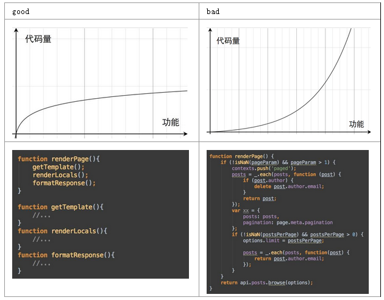

## 软技能

### clean code
#### [没有对比就没有伤害，优秀的代码VS糟糕的代码](http://www.techug.com/post/good-code-vs-bad-code.html)
代码层次清晰、职责单一、模块化便于复用和扩展，所以新功能只需要添加少量代码
最愚蠢的程序员都能写出机器能读懂的代码，而优秀的程序员能写出人可以读懂的代码
保持函数短小，将复杂的逻辑分步骤完成，使你的代码更加易读。

#### [程序员的核心能力 - 引擎式思维](https://www.yejianye.com/2018/01/06/engine-thinking/)
引擎式思维的核心是：DRY（don't repeat yourself）。通过对业务需求的抽象和规约，把解决方案从解决一个问题扩展到解决一类问题，让架构能持续支持业务的需求迭代。
>把你代码中普适的、可重用的部分与具体业务逻辑分离的思想，就是引擎式思维。在游戏中我们叫它引擎(Engine)，在应用开发中我们叫它框架(Framework)，在基础服务里我们又叫它架构(Architecture)，但它们背后的思想是相同的。

避免过度设计：先解决主要矛盾。
>在设计引擎时，我也会使用80/20原则，让引擎能很好地解决80%的需求，对于剩下的20%，引擎需要有一种fallback 机制，它只要做到不挡道，能让使用者自己去解决这些需求就行了。

例1：游戏开发
>大家都知道写游戏的时候，会先写一个核心引擎，它把显示游戏场景、粒子系统、物理模拟等游戏中最普遍的问题抽象在了一个代码库中，这部分的逻辑会在游戏中被不断重用，甚至在多个游戏中重用。在有了引擎之后，上层的游戏开发人员就可以把精力集中在游戏内容的制作上。

例2：git hook presubmit

需求总是不断迭代：
>1. py和js提交前进行风格检查
>2. py增加单元测试
>3. 部分py不需要执行单元测试
>4. 图片提交前用TinyPNG压缩
>5. 另一个git repo也想用这个presubmit脚本，但是先关闭py单元测试

需求抽象：某个条件包括正选和反选
>如果文件名符合某个条件，就对该文件执行一个特定函数

### 个人成长

#### [工程师成长之路：工作1-3年工程师如何突破瓶颈期？](https://mp.weixin.qq.com/s?__biz=MzAwMDU1MTE1OQ==&mid=2653547791&idx=1&sn=8a14104ba13cd1ef634c8991f6700566)

1. 工程师发展的阶段（注：基本上和狼厂T4-T7的要求差不多）

>很大程度上，职业发展的前面两个阶段，已经决定了未来的职业发展路径。

>成熟期是整个职业生涯中最关键的时期，快的可能一两年就能走过去；慢的，可能整个职
业生涯都定格在成熟期。

>成熟期，是工程师成长中的一个关键时期，迈过去这个坎儿，更多需要的是精神层面的东
西。

|阶段|硬技能|软素质|工作内容|驱动力|
|-|-|-|-|-|
|新人期|理论转化为实践|养成基本的职业观|一个具体的任务|领导安排步骤123（被动）|
|成熟期|积累业务和技术|固化职业观|一个项目整体把控|项目拆解并落地（半被动，项目驱动）|
|发展期|明确细化的职业发展方向（技术、管理或两者兼具）|逐步总结形成自己的方法论|一个专业方向发展|从专业角度发现和定义问题（主动，技术规划）|
|事业期|释放自己，创造价值|输出方法论，影响其他人|代领多个专业团队，将技术转化为生产力|自主的从公司产品和战略出发（主动，战略规划）|

2. 最佳实践
    
    * 自我驱动
    >所以从这个角度讲，一个人要想获得更好的职业发展，一定要很好的去培养自己的主动性，一方面主动获取成长，另一方面，还要在公司中主动的承担更多的问题，这样才能够获取到更多思考的机会。进入成熟期后，很快工作就很少，甚至不能给你的成长产生驱动力了。剩下的就得靠自己。告诉自己两件事：“积累具体知识”调整到“提升抽象思维”，“主动思考下一职级的问题”。

    * 复盘
    >另一方面，站在个人角度而言。对自己做过的事情，复盘总结往往是最佳的成长机会。因为当你完成一件事情之后，你就对事情的全盘有了了解。这个时候，回过头去看这件事情，就是现成的“站在更高视角看问题”的机会。

    * 并行任务的时间管理
    >有没有碰到过你的 Leader 在你上一件事情没有完成的时候，给你就分配了下一件事情的情况？同时又来了几个来自其他同事的需求。作者建议：全身心投入当下正在处理的事情。如果有新的需求过来，2 分钟内，判断出这件事情的重要性。重要且十万火急的事情，立即处理；否则，扔进自己的 TODO List，设定一个时间提醒自己再进行关注。完成手头的事情后，从你的 TODO List 整理，找出下一件最重要的事情。如果有多项重要紧急的事情，无法独自完成，将问题暴露给 Leader。每天早晨看看自己的 TODO List，对当天一定要处理的事情有明确的认知。每周 review 回顾自己做过的事情。

    * 排期
    >大事是不明确的，无法直接给出工作量预估，那么把它拆解到你能预估的小的事情就可以了。同时，在你评估过工作量的事情，最终完成之后，去复盘，看自己的评估是否准确，如果有偏差，思考问题出在哪里，长此以往，一些大事你也就可以直接评估出工作量了。

    * 自信
    >内部：来自自己的认可，学习让自己觉得自己牛逼，应用让自己相信自己真牛逼。外部：来自别人的认可，分享让别人觉得自己牛逼，抽象和迁移帮助别人变得牛逼。

#### [渴望成长的工程师-你了解一万小时定律吗](https://mp.weixin.qq.com/s/NWCeQdfk9hrYbP4KrD2CsA)

TLDR

1. 婚前时代，995，晚上十二点休息，工作日每天应该有2小时自由支配时间。**我觉得应该每天9点干完活，2小时回家自学**，为了保证这2小时的效率，前一天尽量不熬夜，中午要午休。
2. 离开舒适区，会的知识不用来回来去看，即非要看尽量利用碎片时间。

note

1. “一万小时定律”想解决什么问题？

    >其实, 从事工程师这个职业的同学, 大部分都是有很高的学习热情的, 尤其在刚工作的那两三年. 只不过, 后来他们的热情被逐渐的消磨, 才有了"三十五岁危机", 才有了我在那篇文章中提到的"可能很多人终生都停留在成熟期". 是什么消磨掉了他们的热情呢? 他们以为自己努力了, 但是甚至都没有得到自己的认可.

2. 一万小时有多长
    * 平均算法

        >一万小时意味着, 每天付出3小时专门的训练, 我们需要坚持10年时间.

    * 衰减算法

        >做个总账吧, 大学四年, 你可以轻松的拥有8000小时的时间去提高自己, 婚前6年, 可以有6000小时提高自己, 育前2年左右, 大概有1000小时, 育后, 每年应该就只有一两百小时的样子了.

3. “一万小时定律”是什么

    >一万小时定律, 是<异类>中提到的, "1万小时的锤炼是任何人从平凡变成世界级大师的必要条件。".

4. “一万小时定律”的最佳实践
    1. 离开舒适区：舒适区没有学习难度，自己可以处于心理舒适状态

        >"家庭主妇每天在做饭上, 投入约为1-2小时. 婚后生活约为40-50年. 所以, 家庭主妇在做饭上投入的时间大概有小两万小时. 但是, 他们并没有成为大师."

        >当碰到有挑战的问题时, 伴随着心理的不适, 我们本能的就希望尽快的摆脱这种状态.当一个又一个小的挑战被放弃之后, 逐渐形成了习惯, 以至于, 每次学习, 好像并不能获得新的知识.

        >当你在目前的学习中, 已经无法得到负向的有效反馈, 那就代表当前已经处于舒适区了, 此时可能很难直接找到这个方向的下一个学习区. 此时, 建议换一个明确自己处于学习区的方向进行学习. 在你整体学习体系之下, 不同方向的知识应该是相辅相成的. 这就像盘山公路的S形设计一样

    2. 逐层深入，避免进入恐慌区：学习的内容对于自己有一定的挑战，心里不会太难受，避免超出自己能力范畴太多（即恐慌区）导致崩溃并放弃学习。作者举了他学习正则表达式的经历，200个小时横跨8年，从最开始只能粗浅的使用正则（从java开始，到python、js、php各种语言），到后来理解它的实现原理，再逐步涉及到到编译原理。

#### [程序员如何在技术浪潮的更迭中保持较高的成长速度 ？](https://mp.weixin.qq.com/s/6EpeirxGg3eIM0dy77E16Q)
1. 正确看待焦虑和迷茫
* 来源：学习一些本职工作中可能用不到的知识，不经过大量的实践是低效的，不高效的学习又遇到了别人高速的成长以及开源社区的高速发展（前端、机器学习、深度学习各种框架层出不穷），新的焦虑又会产生。
* 最佳实践：T型人才
    * 优先：项目驱动
        * 知其然，不误用：学习并正确的使用开源软件，以实现项目需求为目标
        * 知其所以然：原理剖析，源码阅读
    * 业余时间：
        * 了解和项目中使用的技术类似的技术，以点带面，触类旁通
        * 了解其他横向大的技术方向。大的技术方向都是有门槛、水挺深的，浅尝辄止，防止舍本逐末，占用过多的时间
2. 业务和架构如何选择
* 业务的现实：表面上技术含量不高、不同的公司业务流程千差万别、业务是给公司赚钱
* 业务对架构的作用：[架构的本质是为了服务业务](http://geek.csdn.net/news/detail/100463)，只有完整、深入理解业务，才可能把个人或团队的技术积累和解决方案泛化和抽象，去解决业务痛点或难点，