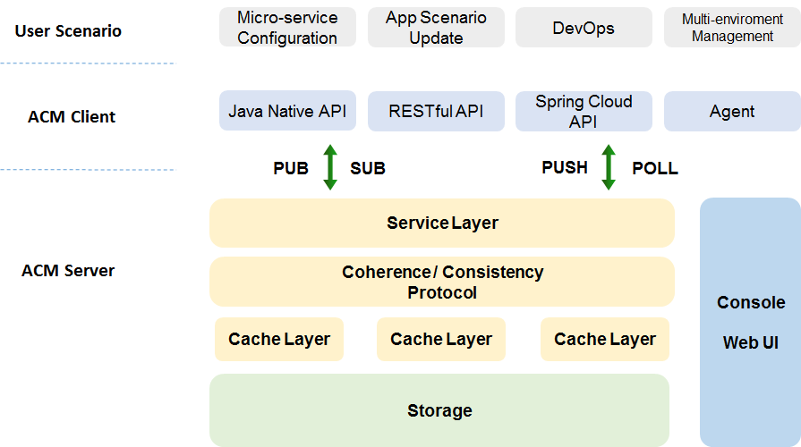
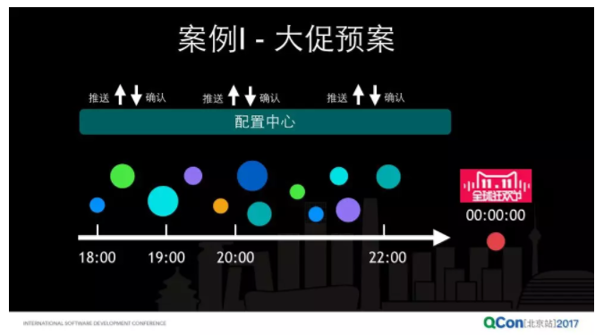
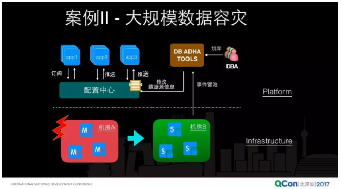
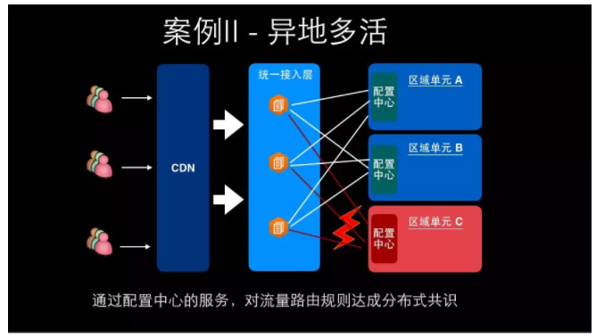

## 配置中心

### Question

### Theory

### Practice
#### 阿里云应用配置管理（ACM）
1. 分布式环境配置变更痛点
效率：不论是日常变更还是紧急回滚，都需要逐个登录服务器手动修改，配置文件的位置、修改后是否生效（注：连接关系变更存在长尾）也需要人工检查
安全：手动修改出错率高，缺乏版本管理、权限控制、灰度发布和回滚、轨迹跟踪（228就是脚本修改了配置文件，但是不知道是哪个脚本、如何触发的）等功能
3. 主要特性
    * 多语言、框架支持：Java (Spring-Cloud), Node.JS, Python
    * 版本管理、灰度发布和回滚
    * 配置推送轨迹
    * 多租户隔离：同一账号下开发、测试、生产环境的配置隔离
1. 系统规模

>目前世界上最大的配置中心，存储了超过百万的生产配置，在集团内部支持了包括淘宝、天猫、菜鸟、阿里云、高德等全网几乎阿里所有的应用，每天产生近 10 亿次的配置变更推送。

1. 配置中心发展历史

>虽然我们做配置中心起步的比较早，但是在业界总是有一些神人，他们有超越常人的远见。论文的题目就是[《分布式系统的动态配置》](https://spiral.imperial.ac.uk/bitstream/10044/1/452/1/Dynamic%20Configuration%20for%20Distributed.pdf)。1984 年是什么概念呢，我当时是 3 岁，那时候还在穿开裆裤，可能还在玩泥巴，而我们配置中心的主力架构师，当时还没有出生。所以做技术，有的时候有些大神通过现象看本质的能力，技术的视野之远我们不得不佩服。

>淘宝的配置中心是在07-08年“五彩石”项目中产生的。服务化首先要解决的是服务发现，所以需要一个服务注册中心，所以这里也有一个插曲：当时我们的注册中心叫 ConfigServer，@晓斌的老板后来吐槽我们说，中国工程师，你们这个英文水平太差了，明明是个注册中心，你叫 ConfigServer，你说现在叫大家怎么理解。这也是我们走过的一段弯路，所以后来发现注册中心和配置中心是2个不同的关注点。

4. 技术架构

技术决策的原则：作为一个配置中心，当所有的系统都依赖你去做配置管理的时候，就必须回答一个问题：当你挂了，其它人怎么办？这个里面对配置中心有几个关键的技术决策点，从逻辑上来说其它业务系统对于配置中心的依赖应该是一个弱依赖。

配置中心提供的客户端或者 SDK 其实应该实现客户端缓存。

2. 应用场景
运营活动应用场景推送

>配置中心会在这个时间轴上，定时地安排执行预案，每个系统哪些功能降级，在什么时候降级，什么时候开放哪些专门为大促存在的一些功能，在大促之前的时间点，整个应用发布会封盘，被禁止掉了，已经不允许做任何线上发布了，那在这个时候要切换系统的行为，那就是靠配置中心去做这个事情。

mysql主备切换

>比如像 mysql，在生成上我们为了高可用，可能会配备一主几备，主库是可写的，备库可能是只读的。在生产上可能有几台机器坏了或者甚至一个机房坏了，所有应用基于配置中心监听各自的数据源配置变更，当产生主备库切换，配置中心会将数据源配置变更推送到应用，整个过程对应用是透明的，无感知的。应用是不用知道底下机房出问题了，主备库出现切换了。

异地多活

### Reference
1. [Aliware推出应用配置管理大杀器，分布式架构下配置推送秒级生效](https://www.toutiao.com/a6480759306634396173/?tt_from=copy_link&utm_campaign=client_share&app=news_article_social&utm_source=copy_link&iid=9545948642&utm_medium=toutiao_ios)
2. [应用配置管理ACM](https://help.aliyun.com/document_detail/59953.html?spm=5176.163362.847321.doc.2869f46bxeU7rM)
3. [阿里巴巴微服务与配置中心技术实践之道](https://mp.weixin.qq.com/s/VIKuizuF83kHCvWd88NEOw)
4. [微服务与配置中心：别让您的微服务被配置管理“绊”了一跤](http://www.infoq.com/cn/presentations/micro-service-and-configuration-center?spm=a2c4e.11153940.blogcont332358.36.30772099lWiw8H)
2. [干货 | 携程开源配置中心Apollo的设计与实现](https://zhuanlan.zhihu.com/p/28723169)