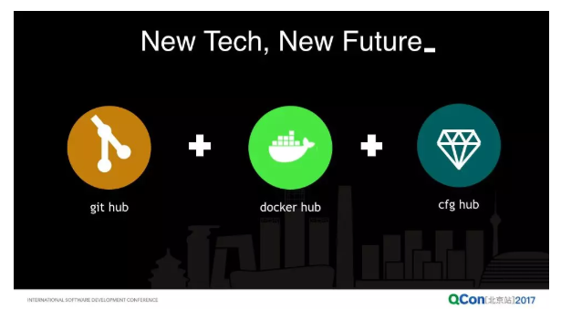
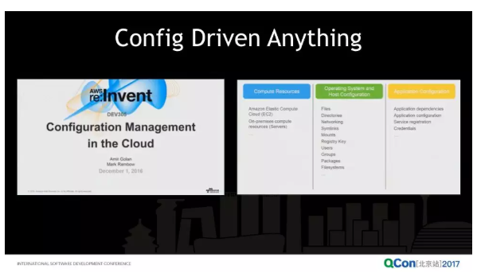
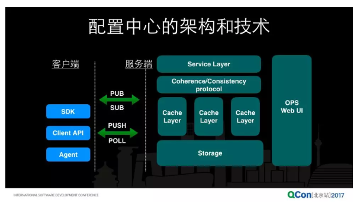

## 配置中心

### Question

### Theory

### Practice

#### 携程开源配置中心Apollo

##### 1 feature
配置项维度：应用（application）、环境（environment）、集群（cluster）、命名空间（namespace）
配置治理：版本管理、灰度发布、权限控制、变更审计、Java原生sdk+Spring插件+开放平台API

各种功能的界面见附4的3.2-3.7节

##### 2 depth

###### 2.1 concept

* application：Java通过classpath:/META-INF/app.properties指定appId
* environment：通过读取机器上配置/opt/settings/server.properties中的env配置项
* cluster：通过读取机器上配置/opt/settings/server.properties中的cluster配置项
* namespace：namespace是配置项的集合，物理上就是一个配置文件。Apollo为配置文件设置了私有、公共、继承三种类型，目的是复用配置项（Don't Repeat Yourself）。

##### 2.2 architecture

模块功能：

    1. AdminService：提供配置的修改、发布等功能，服务对象是Apollo Portal（管理界面）
    1. ConfigService：提供配置的读取、推送等功能，服务对象是Apollo客户端，多实例、无状态部署
    1. MetaService：对客户端和Portal对Admin和Config的发现功能
    1. Portal：提供配置中心的所有操作功能，服务对象是用户

架构演进从1到N：

    1. 为什么引入了eureka：sdk对ConfigService的服务发现问题，sdk机器很多（单逻辑机房1万）并且需要保证高可用，所以ConfigService需要多副本
    1. 为什么引入了MetaServer：eureka的sdk只有java，为了支持多语言sdk的服务发现，通过MetaServer对sdk封装了restful的服务发现接口。
    1. 为什么引入了nginx lb：MetaServer同样是多副本的，sdk对MetaServer同样存在服务发现问题，所以利用nginx做反向代理，sdk只需要配置域名

为什么选型eureka：一句话简化配置中心服务部署

    1. eureka&MetaServer&ConfigService部署在一个jvm中
    1. 和spring cloud无缝集成，MetaService额ConfigService也是用spring cloud实现
    1. 经过netflix的生产环境验证的服务注册和发现组件

##### 2.3 dataflow
用户发布配置后如何发布：拉模型

1. 服务端：
    1. AdminService发布配置后往ReleaseMessage表插入一条消息记录：AppId+Cluster+Namespace
    2. ConfigService有一个线程会每秒扫描一次ReleaseMessage表，如果发现有新消息，那么就会通知对应notifications接口返回有配置更新
2. 客户端：
    1. sdk发起一个Http请求到ConfigService的notifications接口，它不会立即返回结果，而是通过Spring DeferredResult把请求挂起
    2. 如果在60秒有新配置发布立即返回，否则返回Not Modified-304给客户端
    3. 客户端从返回的结果中获取到配置变化的namespace后，会再请求ConfigService获取最新配置。

##### 2.5 high availability
1. 客户端本地缓存最新文件，防止网络问题和服务端bug。默认路径：/opt/data/{appId}/config-cache/{appId}+{cluster}+{namespace}.properties，可以配置。
2. 客户端定时上报本地版本（默认5min）从服务端拉取应用的最新配置，防止推送机制失效导致配置不更新。所以一般情况下对于定时拉取的操作服务端都会返回304。
3. 服务端无状态多副本。

##### 3 comment

1. application&environment&cluster可以和PaaS关联，PaaS中托管的app本身就带有environment、cluster的tag。特别是env和cluster，通过机器上的文件维护容易出错切成本很高。
1. namespace的功与过
    * pros：配置信息中心化提供了跨应用共享配置的能力。在不使用配置中心的系统中，A应用想看到B应用的一个配置，需要把配置随请求透传（BIDU_PSSE就是这样做的，例如下游想知道上游等待的超时时间配置同于实现动态TTL）。
    * cons：公共配置设计初衷是DRY，但是共享即耦合。修改公共的配置需要很慎重，需要在配置中心支持依赖反向查询。否则公共的配置最后都会被继承了（例如：A应用和B应用共享一个配置，但是A有个需求想修改配置，B又不知道改了这个配置以后对自己有啥影响，那么最终是A继承了，这个配置的共享的好处就没了）。
1. Portal和AdminService的服务发现架构设计的有些冗余，这俩服务都是用户从网页上操作的，通常单逻辑机房主从冷备就够了（BIDU_PSSE的PaaS总控就是主从冷备）。我理解是因为AdminService和ConfigService在一个jvm中，AdminService的实例很多并且反正ConfigService也要用nginx+MetaService做服务发现和负载均衡，干脆就用nginx+MetaService顺便把Portal和AdminService一起搞了。
1. PortalDB和ConfigDB的拆分设计我认为思路还是值得借鉴的，低频、关系型的数据存在PortalDB中，高频、kv型的数据存在ConfigDB中（BIDU_PSSE的kepler-agent conf-server就是用MySQL存储配置项默认值、app有哪些配置项、配置项的最新版本、变更历史等，配置项最新版本值是存在redis中）
1. 绝大多数配置文件变更的时效性要求不是特别高（除了限流、流量调度、防攻击等配置，通常这些配置应该是scp更新，减少外部依赖），定时拉模型够用了。watch或server-push对server端的压力很大，而且挨个push也快不了多少。

###### 4 question

1. 没有介绍ConfigDB和PortalDB的实现和高可用，各种无状态的Service搞了一顿高可用，然后DB挂了就gg了。
1. 一个sdk应该只连接一个ConfigService还是每次60s的长连接会换一个ConfigService？
1. 没有介绍版本管理、分级发布、权限管理。

#### 阿里云应用配置管理（ACM）
##### 1 背景
###### 1.1 分布式系统中配置变更痛点
* 效率：
    1. 日常变更需要程序上线
    2. 紧急回滚需要运维逐个登录服务器手动修改
    3. 配置文件的路径、配置项名称五花八门，无用的配置项很多
    4. 需人工检查修改后效果，只能抽查部分服务实例，可能导致同构服务存在差异（注：A->B，变更A服务配置文件中B服务的ipport，如果10%的A服务实例没能成功变更对B的连接关系，可能B服务实例已经删除或者迁移，这10%的A服务实例就无法正常请求B）
* 安全：
    1. 手动修改出错率高
    2. 缺乏版本管理、权限控制、灰度发布和回滚、轨迹跟踪（注：228就是脚本修改了配置文件，但是不知道是哪个脚本、如何触发的）

###### 1.2 发展历史
>虽然我们做配置中心起步的比较早，但是在业界总是有一些神人，他们有超越常人的远见。论文的题目就是[《分布式系统的动态配置》](https://spiral.imperial.ac.uk/bitstream/10044/1/452/1/Dynamic%20Configuration%20for%20Distributed.pdf)。1984 年是什么概念呢，我当时是 3 岁，那时候还在穿开裆裤，可能还在玩泥巴，而我们配置中心的主力架构师，当时还没有出生。所以做技术，有的时候有些大神通过现象看本质的能力，技术的视野之远我们不得不佩服。

>淘宝的配置中心是在07-08年“五彩石”项目中产生的。服务化首先要解决的是服务发现，所以需要一个服务注册中心，所以这里也有一个插曲：当时我们的注册中心叫 ConfigServer，@晓斌的老板后来吐槽我们说，中国工程师，你们这个英文水平太差了，明明是个注册中心，你叫 ConfigServer，你说现在叫大家怎么理解。这也是我们走过的一段弯路，所以后来发现注册中心和配置中心是2个不同的关注点。

###### 1.3 未来
>我们认为将来一个应用程序会分成三个部分，第一个你的源代码可能是在 github 里面，你的应用的镜像，docker 镜像可能是在 docker hub 里面，而你的配置从源代码里面切出来之后，是放在一个 cfg hub 里面，而这个 cfg hub 其实就是一个配置中心。

>其实从去年亚马逊云计算大会上就提到在云上怎么做配置管理，他们的想法关于配置管理的外延更大，他们认为不光是应用进程，与云计算相关的所有的资源，包括 IaaS 层，包括诸如用户安全组啊等这些资源全都是可以通过配置去驱动的。

##### 2 hello world

###### 2.1 主要特性

* 多语言、框架支持：Java (Spring-Cloud), Node.JS, Python
* 版本管理、灰度发布和回滚
* 配置推送流程跟踪
* 多租户隔离：同一应用开发、测试、生产环境的相同配置项可以配置不同值

###### 2.2 系统规模

>目前世界上最大的配置中心，存储了超过百万的生产配置，在集团内部支持了包括淘宝、天猫、菜鸟、阿里云、高德等全网几乎阿里所有的应用，每天产生近 10 亿次的配置变更推送。

###### 2.2 SLA
* prefered：<500ms 99.9%
* ok：<3s 99.9%

##### 3 干货
###### 3.1 架构

* 配置中心容灾：当所有应用都依赖配置中心去做配置管理时，就必须回答一个问题：当你挂了，其它人怎么办？从逻辑上来说其它业务系统对于配置中心的依赖应该是一个弱依赖。配置中心提供的客户端或者 SDK 其实应该实现**客户端缓存**，它对配置中心起到了容灾的作用（注：本地cache是旁路cache的容灾）。

* 灰度发布、变更审计：没具体说怎么实现的。

* server端：内存缓存提升拉模型下配置中心的处理能力，持久化存储是考虑容灾，选型比较多etcd、redis、amazon s3、git（Spring Cloud Config使用的是git）

* client端：
    1. sdk or agent：没说怎么选择哪一种。单体应用倾向于sdk，微服务倾向于agent。
    2. pull or push：文中说常用pull，实时性高的场合使用push

注：**配置管理没有银弹**。通过下面的案例可以发现通过配置中心管理的配置的特点：变更频次低但时效性要求高。大促频次还算比较高的，但是mysql主备切换、异地多活路由规则都是在系统正常状态下不会出现的，但是一旦出现需要配置变更立即生效。此时通过程序版本上线就无法满足了。所以不是所有的配置都需要通过配置中心管理。

###### 3.3 案例
1 运营活动应用场景推送
>配置中心会在这个时间轴上，定时地安排执行预案，每个系统哪些功能降级，在什么时候降级，什么时候开放哪些专门为大促存在的一些功能，在大促之前的时间点，整个应用发布会封盘，被禁止掉了，已经不允许做任何线上发布了，那在这个时候要切换系统的行为，那就是靠配置中心去做这个事情。

2 mysql主备切换
>比如像 mysql，在生产上我们为了高可用，可能会配备一主几备，主库是可写的，备库可能是只读的。在生产上可能有几台机器坏了或者甚至一个机房坏了，所有应用基于配置中心监听各自的数据源配置变更，当产生主备库切换，配置中心会将数据源配置变更推送到应用，整个过程对应用是透明的，无感知的。应用是不用知道底下机房出问题了，主备库出现切换了。

3 异地多活
>配置中心要起到一个关键的作用是要在统一接入的机器上，要让它们对于全局的流量规则达成一个分布式共识，这个实际上是分布式一致性的一个要求。

### Reference
1. [Aliware推出应用配置管理大杀器，分布式架构下配置推送秒级生效](https://www.toutiao.com/a6480759306634396173/?tt_from=copy_link&utm_campaign=client_share&app=news_article_social&utm_source=copy_link&iid=9545948642&utm_medium=toutiao_ios)
1. [产品概述_产品简介_应用配置管理 ACM-阿里云](https://help.aliyun.com/document_detail/59953.html?spm=5176.163362.847321.doc.2869f46bxeU7rM)
1. [阿里巴巴微服务与配置中心技术实践之道](https://mp.weixin.qq.com/s/VIKuizuF83kHCvWd88NEOw)
1. [携程开源配置中心Apollo的设计与实现](https://zhuanlan.zhihu.com/p/28723169)
1. [微服务架构~携程Apollo配置中心架构剖析](https://mp.weixin.qq.com/s/-hUaQPzfsl9Lm3IqQW3VDQ)
1. [Apollo核心概念之“Namespace”](https://github.com/ctripcorp/apollo/wiki/Apollo%E6%A0%B8%E5%BF%83%E6%A6%82%E5%BF%B5%E4%B9%8B%E2%80%9CNamespace%E2%80%9D)