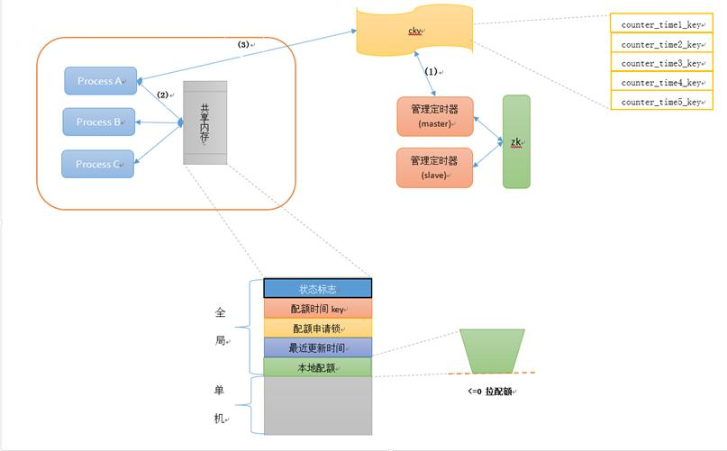
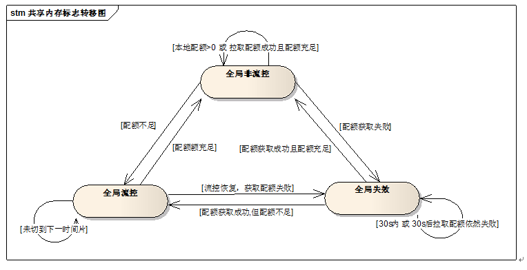
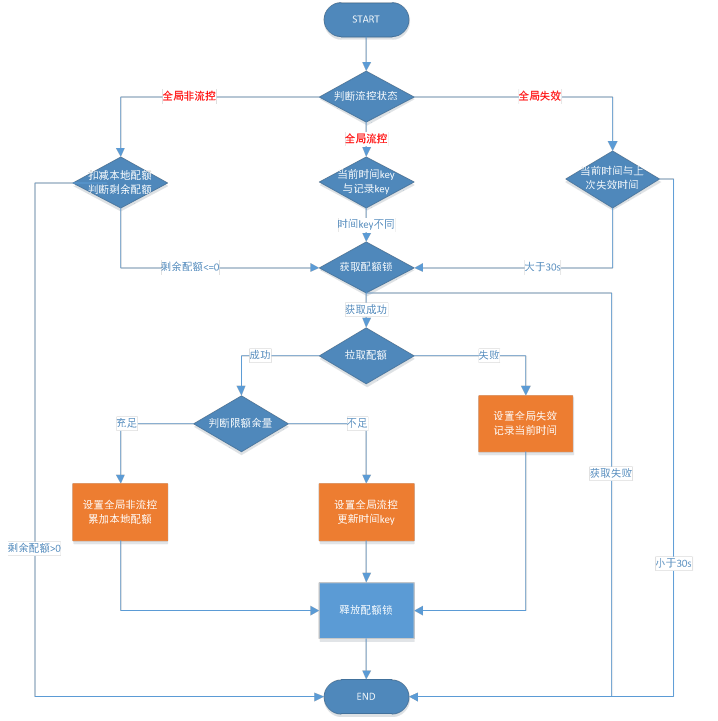
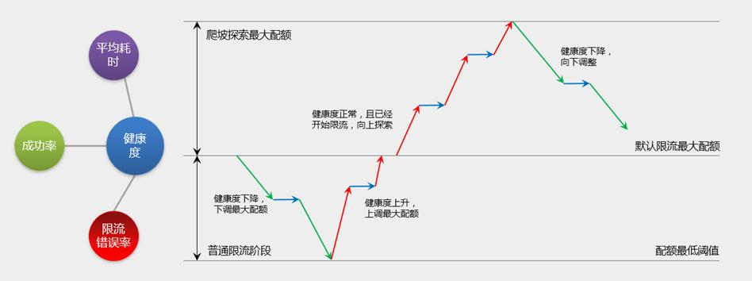

## 限流

### Question
1. 引用中第一篇博客说分布式系统不能在单节点使用限流算法，而是需要一个全局的redis？
>最快的方式是使用 RateLimit 类，但是这仅限制在单节点，如果是分布式系统，每个节点的 QPS 是一样的，请求量到服务接口那的话就是 QPS * 节点数 了。所以这种方案在分布式的情况下不适用！

如果每个节点都限制了自己的QPS，集群的节点数是一定的，集群的QPS是可以限制的。第三篇博客通过对单机流控和全局流控的比较解释了这个问题。

1. 单机流控每个节点限制自己的QPS的在实际工程中可能存在的问题：
    1. 负载均衡不可能保证下游所有单机流量都是均匀的。例如：搜索引擎使用hash(query_word) % server_num调度，热词会导致单机热点。如果单机QPS阈值设置过低会导致出现热点的单机被误限，阈值设置过高会导致起不到限流效果（大多数单机QPS都逼近阈值，还不启动限流会导致后端集群雪崩）。
    2. 同一种服务独占物理机，机型可能是异构的，导致同一个服务的QPS需要根据物理机进行差异化配置，对运维不友好。可以通过容器化解决，机型机构但是服务有相同的资源quota（归一化CPU、mem、IO）。
    3. “机器数变化时，限流配额要调整”。机器数变化包括两种情况：接入层机器扩容（后端业务逻辑层没扩容），此时需要把接入层单机QPS限流阈值下调，防止逻辑层容量不足；逻辑层扩容，此时需要把单机阈值上调。限流阈值的调整和扩容耦合，对于自动化弹性扩容是运维不友好的。

1. 为啥令牌桶算法重复时间间隔精度会不够，usleep(1)不行？
1. 改成触发式添加令牌不就退化成限制QPS的方法吗，为啥不会导致单个时间窗口内令牌不均匀？

### Theory
1. 限制并发：“请求队列+工作线程池”架构中工作线程池中的活跃线程数就是并发。
2. 限制QPS：使用一个全局变量表示令牌数量，工作线程对这个变量递增，如果超限就拒绝，通过一个后台线程每秒清零这个变量。（译者注：**这种方法相当于令牌桶算法中r和b相等，优点是简单，缺点是后台线程清零全局变量不是匀速的向桶里面放入令牌，虽然确实限制了QPS，但是1秒内的流量分布可能不均匀，导致工作线程数瞬间打满造成机器资源争夺**。）
3. 令牌桶
    1. 算法描述：
        1. 假如用户配置的平均发送速率为r，则每隔1/r秒一个令牌被加入到桶中
        2. 假设桶中最多可以存放b个令牌。如果令牌到达时令牌桶已经满了，那么这个令牌会被丢弃
        3. 当流量以速率v进入，以相同的速率从桶中令牌，拿到令牌的流量正常处理，拿不到令牌流量执行熔断
    1. 算法分析：
        1. r：长期来看流量实际处理的速率，拒绝的流量为(v-r)
        2. b：应对流量突增

### Practice
#### Guava::RateLimiter
[github.com/google/guava](https://github.com/google/guava)包含了若干被Google的Java项目广泛依赖 的核心库，例如：集合（collections）、缓存（caching）、原生类型支持（primitives support）、并发库（concurrency libraries）、通用注解（common annotations）、字符串处理（string processing）、I/O 等等。 所有这些工具每天都在被Google的工程师应用在产品服务中。

[RateLimiter](https://github.com/google/guava/blob/master/android/guava/src/com/google/common/util/concurrent/RateLimiter.java)是Guava的Java版本的令牌桶算法。

原始令牌桶算法存在的后台线程重复的间隔精度不够精确的问题：后台线程需要每1/r秒向桶里添加一个令牌，r>1000时线程执行的时间间隔根本没办法设置。所以Guava采用了请求触发添加令牌：取令牌之前先添加令牌，添加令牌的数量=max(b,(当前时间-上一次添加令牌的时间)/r)

#### [github.com/juju/ratelimit](https://github.com/juju/ratelimit)
github上star比较多（600+）的golang版本令牌桶算法

#### [github.com/wukq/rate-limiter](https://github.com/wukq/rate-limiter)
用于redis的lua实现的触发式令牌桶算法

#### [ngx_http_limit_req_module](http://nginx.org/en/docs/http/ngx_http_limit_req_module.html)
[nginx官方博客](https://www.nginx.com/blog/rate-limiting-nginx/)介绍的限流模块

#### 腾讯轻量级全局流控方案
##### 基本思路
全局计数器记录了1s内的请求数（计数），在达到1s时计数器需失效或清零（计时）。

redis实现：计数可以通过incr单命令实现，计时只能通过lua脚本实现，incr不支持expire。lua脚本尽管是原子的，但是因为全局的redis的QPS和限流之前全局QPS是相当的，所以高并发的会存在性能瓶颈。

请求数上报：每个PV都对全局计数器+1，实时性好，全局计数器QPS会很高；单机定时汇聚好再上报，实时性有损失，但是全局计数器的访问压力也会降低。

##### 轻量在何处？
1. 计数器的key能“计时”：将时间信息写入key，把一天按时间划分（比如1s划分一个key）为若干个key作为计数器。这样每个key既能使用incr方式计数，同时也有“计时”的能力，当超过划分时间（比如1s后），就顺移到下一个key上做计数。比如频率限制任务1配了阈值为5000/s的全局流控，那么就以每一秒生成一个kv为例：
```
key: task1_20170617000000、task1_20170617000001、task1_20170617000002
value: 5000
```

机器时间不一致？key中的时间信息是1s，ntp服务的精度一般情况是<10ms，只要ntp能正常运行，全局流控的单个时间片的计数是准确的。如果ntp服务没正常运行，某一时刻会出现超过两个时间片key的配额值发生变化，通过监控报警存在机器时间不一致的情况。（思考：除了报警，限流功能本身应该如何容错？如果允许ntp服务异常的机器拉取配额，如果机器的时间比真实时间慢，能够拉取到配额，如果机器时间快，会导致未来的总配额减少造成误限。）

2. 请求统计用拉取的方式替换上报：每个key初始化时写入流控阈值，每个业务机器并非上报请求量，而是访问全局计数器拉取配额到本地保存，本地配额消耗完毕再次拉取，类似余库存扣减。比如拉取配额设置10，即每处理10个业务请求（注：上一次拉取的配额用完）流控sdk会拉取新一次的配额，拉取配额对业务请求耗时增加约1ms（注：拉取配额必须在业务请求中同步完成）。

配额拉取值的设定：一次拉取的配额太小会增加ckv的访问压力和业务的耗时，配额要太大会导致配额浪费，其他机器在这个时间片拉不到配额，造成误限。原文给的做法是“全局流控阈值10000/s，机器数20，平均单机流控阈500/s，配额值参考值设定为单机流控阈值的1/10。再结合压测观察和微调”（思考：配额值设置为500为啥不行？第1秒拉取500配额，立刻来了1000个请求把500个配额用完，限制了单机流控500/s，这一秒内再来的请求也会拒绝。）

3. 部署不需要agent：通过sdk实现配额拉取，去掉agent减少部署、运维成本。

4. 对全局计数器的容灾：全局流控失效（ckv挂掉或连续超时导致拉取配额失败），sdk判断出这种情况后，暂时停止使用全局流控，而单机流控依然可以正常工作，sdk定期去探查（比如30s）全局流控是否恢复可用，再启动全局流控。

5. 性能：
    1. 目前方案单独申请了一块ckv，容量为6G，使用incr的方式，压测性能达到9w+/s。
    2. 对业务空接口（Appplatform框架）做流控压测，使用30台v6虚拟机，单机50进程，压测性能达到50w+/s。上述的压测瓶颈主要是Appplatform框架的性能原因，由于拉取配额值是根据流控阈值设定（一般>10），50w+的请求量只有不到5w的ckv访问量，ckv没到瓶颈。

##### 具体实现





管理定时器：写入每个时间片的配额kv。部署在两台脚本机上，通过zk实现master选举，[golang通过zookeeper实现master选举](https://blog.csdn.net/u013235478/article/details/70158522)。（思考：选举结束后，造反的从节点怎么知道“先帝”写到哪个时间片了？）

共享内存：架构图中单机三个进程是不是指同一个任务流控的三个进程（或者说三个容器）部署在同一台物理机，需要对这三个进程的流量和进行限制。如果流控任务都是单机单实例，没必要使用共享内存。不同类型服务就没必要使用共享内存了，不同服务的key前缀是不同的，限流配额互不影响。

状态机：
    1. 全局非流控：先扣减本地配额，本地配额<=0时，就走拉取配额流程
    2. 全局流控：本地配额<=0时，先判断key是否发生变化，同一个时间间隔内配额已经消耗完，减少无效的拉取
    3. 全局失效：以固定的周期探测ckv是否恢复（思考：如果遇到网络抖动导致ckv时好时坏，会导致限流在单机限流和全局限流状态之间抖动。如果简化一下模型，只在接入层的nginx上限流，通常一个逻辑机房的nginx都是部署在单个物理机房的，ckv和nginx部署在相同的物理机房，能够规避物理机房之间的超核异常导致的网络抖动。）
    4. 拉取配额先获取锁（注：在共享内存中），架构图中相同业务的三个进程只有获取锁成功的进程才能拉取配额。如果获取锁的进程出core没有释放导致死锁，其他进程会通过加锁时长来主动释放锁接触死锁（思考：如果不是同一个流控任务在一台机器上有多个服务进程实例，就没必要加锁。）。

### Reference
1. [基于分布式环境下限流系统的设计](https://zhuanlan.zhihu.com/p/31484931?comefrom=http://blogread.cn/news/)
2. [基于Redis的限流系统的设计](https://mp.weixin.qq.com/s/ewjGZCgc_TUhiZIINCLfbg)
3. [性能百万/s：腾讯轻量级全局流控方案详解](http://wetest.qq.com/lab/view/320.html)