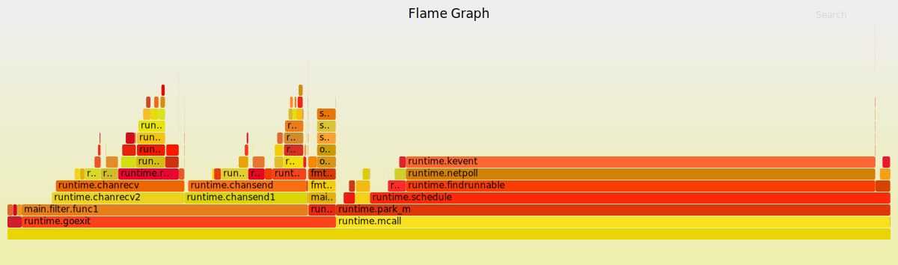
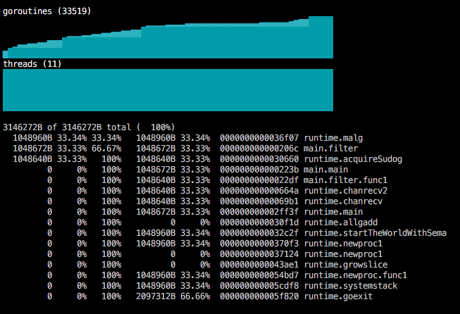

## [A Short Survey of PProf Visualization Tools](http://slcjordan.github.io/post/pprofsurvey/)

[\[译\] Go 可视化性能分析工具](https://segmentfault.com/r/1250000008552697?shareId=1210000008552698)

调试CPU相关的问题经常会导致和变化趋势相关的微妙问题。堆使用是否出现飙升，或者是持续增长？当前的函数被谁调用，调用频率有多高？

>Debugging CPU related issues can often lead to nuanced questions about trends.

### 一图胜千言
图片提供了很有用的上下文信息，如果用文字解释这些信息会很痛苦。如果把pprof数据通过图片可视化展现出来，很有用的CPU统计数据就可以具有时间上下文信息。

>By backing graph visualizations with pprof data useful CPU statistics can be contextualized over time.


### PProf是啥
PProf是一个cpu性能分析器，它是Google开发的多线程应用分析工具gperftools的一部分。golang标准库的pprof包通过HTTP提供了pprof工具所需的数据采集接口。

因为pprof数据通过HTTP接口提供，所以你的应用程序中需要运行一个web服务器。通过`_`导入pprof包就可以在包的初始化时会把pprof的handler注册到默认的的web服务器上，应用程序除了启动默认的web服务器以外，不需要其他别的操作。

对于长期执行的应用程序，下面是使用pprof的例子，取自[net/http/pprof包](http://golang.org/pkg/net/http/pprof/)：
```golang
import (
    "log"
    "net/http"
    _ "net/http/pprof"
)

func main(){
    go func() {
        log.Println(http.ListenAndServe("localhost:6060", nil))
    }()
    ...
```

### 使用pprof


PProf的能力是生成程序调用树的可视化graphviz图。PProf以30秒为周期对运行中的go应用程序采样生成调用树。
* 边代表函数调用，边上标注了函数的调用次数。
* 方框的大小和边上标注的函数调用次数成比例。
* 每个方框包含两个标记：函数执行时间的百分比，函数在栈帧中出现时间的百分比。（译者注：参考译文中说明前者为flat时间，后者为cumulate时间。结合Go-Torch可以理解，前者指的是函数执行时间占这次采样周期30s的比例，后者指一次函数调用栈中，即gdb的backtrace，当前方框的函数占函数调用栈时间的比例。）

>Each box has 2 labels: the percentage of time that the function was running and the percentage of time that it showed up as part of a stack trace.

在mac上安装pprof：
```
$ brew install gperftools
$ brew install graphviz
$ pprof --web localhost:6060/debug
```

译者注：go tool集成了pprof工具，不需要安装gperftools，**只需要安装graphviz（需要把dot设置到PATH）**。通过下面的命令采集30s的数据并生成SVG调用图:
```
go tool pprof -web http://10.75.25.126:9091/debug/pprof/profile
```

### Go-Torch


Go-Torch是Uber开发的通过Brendan Gregg的脚本生成go程序火焰图的工具。和PProf一样，可视化火焰图对应用程序的采样周期是30秒。
* 栈帧按照调用顺序垂直排列，调用深度越深，排列的高度越高。
* 水平宽度表示函数在一个栈帧中的执行时间。
* 如果一个函数被调用了多次，那么这个函数就会有多个祖先，每个祖先表示一个栈帧。这个函数会在每个栈帧中分别显示。
* x轴按照字母顺序，帧的颜色是任意的。

安装包括go-torch工具和Brendan Gregg的火焰图生成脚本：
```
$ go get github.com/uber/go-torch
$ git clone git@github.com:brendangregg/FlameGraph.git
$ export PATH-$PATH:/path/to/FlameGraph
go-torch --file "torch.svg" --url http://localhost:6060
```

### GOM


GOM是一个实时的curse风格命令行工具，由google的Jaana Dogan开发，用于可视化go应用程序的性能分析结果。
* 显示goroutine和线程数随时间变化趋势。
* 实时更新。
* 除了可视化，GOM还提供CPU和堆的文本分析结果。

和pprof包一样，通过`_`导入gom包时会向默认的web服务器注册gom数据采集的HTTP handler。
```
import (
    _ "github.com/rakyll/gom/http"
)

$ go get github.com/rakyll/gom/cmd/gom
$ gom --target http://localhost:6060
```

### Debug charts


Debug charts是Marko Kevac开发的基于plotly.js库的工具，可以为运行的go应用程序创建网页视图。
* 浏览器执行
* 可视化gc pause、内存分配和cpu使用
* 实时更新

通过`_`导入debugcharts包注册handler，然后通过浏览器打开localhost:6060/debug/charts。
```
$ go get github.com/mkevac/debugcharts

import (
    _ "github.com/mkevac/debugcharts"
)
```


