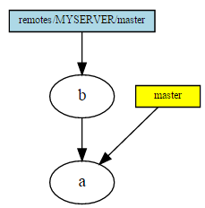
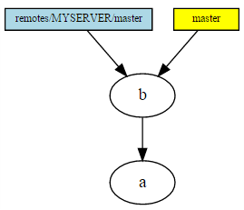
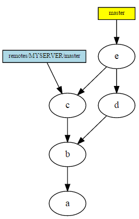
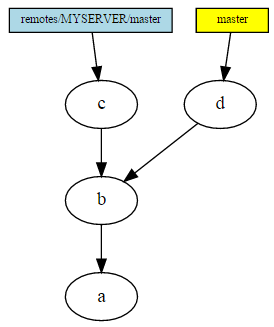
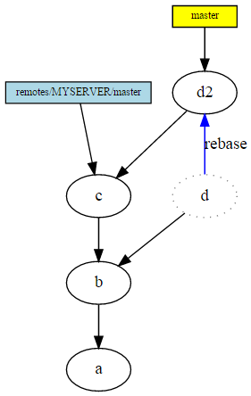

## [Git for Computer Scientists](http://eagain.net/articles/git-for-computer-scientists/)

### 1 摘要
本文向那些不惧怕“[无回路有向图（DAG：Directed Acyclic Graph）](https://en.wikipedia.org/wiki/Directed_acyclic_graph)”类似术语的读者简要介绍git的内部实现。

### 2 存储
把git的实现进行简化，git对象存储是一个DAG对象以及一系列不同类型的对象。这些对象都被压缩存储，并通过SHA-1来标识（值得指出的是，SHA-1不是对文件内容进行哈希得到的，而是对这些对象在git中的表示得到的）。

* blob：最简单的对象，占用若干字节。它可以用于表示文件，也可以是一个符号链接或者其他的什么东西，取决于指向blob的指针的语意。
* tree：表示目录的对象，可以指向blob（此时blob表示文件，文件内容保存在blob中，文件名、权限等保存在tree中），也可以指向其他表示对当前目录下的子目录的tree对象。注：DAG中节点A指向节点B意味着A依赖于B，即A不能没有B。没有被指向的节点可以通过git gc命令进行垃圾回收，或者通过git fsck --lost-found命令像抢救文件系统中没有文件名的inode节点一样处理。
* commit：commit对象指向tree对象，表示提交时文件的状态，对象包含commit的信息。它也可以指向其他的commit对象，这些对象是这个commit对象的父亲。如果一个commit对象有多于一个父亲，则表示该commit是一次merge。如果一个commit没有父亲（指向自己），则表示它是一个初始commit，当然也可能有两个commit都没有父亲，这种情况通常意味着两个独立的项目进行merge。
* ref：表示一个引用的对象，分支和HEAD都是引用。引用的作用好比就是在DAG的节点上贴一个便签。引用类似书签，表示当前的工作状态。Where as the DAG only gets added to and existing nodes cannot be mutated, the post-its can be moved around freely. They don't get stored in the history, and they aren't directly transferred between repositories. git commit命令就是首先添加一个DAG节点，然后把当前分支的引用移动到这个节点上。
HEAD引用有一点特殊的地方是它指向另一个引用，它是一个指向当前活动分支的指针。常规引用都存储在名字空间heads/xxx中，但是使用它们时通常可以省略前缀“heads/”。
* remote refs：表示远程引用的对象，它和常规引用的区别在于所述的名字空间不同，并且远程引用由远程服务器来控制。git fetch命令可以更新远程引用。
* tag：tag对象指向一个提交，它包含一个可选的信息和一个hash签名。The post-it is just a fast way to access the tag, and if lost can be recovered from just the DAG with git fsck --lost-found.

总而言之，git的代码仓库是由DAG和便签组成的。DAG中的节点可以在代码库之间移动，也可以用压缩的方式更有效的存储，没用的节点可以通过垃圾回收释放。

### 3 历史
了解了git如何存储版本历史的知识后，接下来我们对merge等操作进行可视化，并讨论git与线性改变分支的版本管理工具的不同之处。

首先，我们通过克隆远程代码库创建最简单的代码库，并对它进行了一次提交。

接着我们fetch了远程代码库的提交，但是并没有合并它到本地的分支。

git merge remotes/MYSERVER/master之后，因为merge是fast forward模式（本地分支并不进行新的提交），惟一发生的操作就是移动了便签，并修改工作目录中相应的文件。

本地和远程分别进行了一次提交（c和d），显然此时需要进行一次merge。

git merge remotes/MYSERVER/master，因为本地有一次提交d，此时合并不能使用fast forward模式，此时DAG中会新建一个commit节点e，注意e有两个父亲c和d。

经过一次本地提交、两次远程提交以及一次合并后的结果如图。See the "stitching" pattern emerge? The git DAG records exactly what the history of actions taken was.

stitching这个词读起来有些乏味。如果你还没有发布过你的分支，或者和其他人明确沟通过他们不会以你的某个提交为基础进行开发，此时你有个可以替代的做法，即rebase你的分支而不是merge，此时你的提交被另一个父亲不同提交代替，然后你的分支被移动到那里（You can rebase your branch, where instead of merging, your commit is replaced by another commit with a different parent, and your branch is moved there.）。
你的旧的提交在垃圾回收之前都会保存在DAG中。暂时忽略它们，只要记住如果你全搞砸了也有办法（Ignore them for now, but just know there's a way out if you screwed up totally.）。如果有便签指向旧的提交，便签和旧的提交不会被删除，尽管这一行为显得有些让人相当困惑。
不要在其他人可能创建新的提交的分支上rebase，从这种情况回复是可能的并且也不难，但是所需的额外工作会让人沮丧。

merge/rebase之前：下图1。
merge：下图2，创建新的提交e，它的父亲是提交c和d。
rebase：下图3，提交d被新的提交d2代替，rebase之前的主分支为d，父亲是b，rebase之后的主分支为d2，父亲变成了c。

在垃圾回收以后（忽略了不可达的提交）的情况如下图1，d2是rebase以后的主分支，然后在它上面又进行了一次提交h，此时主分支移动到h。
rebase能够在一次操作中处理多个提交节点，如下图2中的h和d2。

我们为对计算机科学不惧怕的读者准备的git简介就结束了，希望它能有所帮助。