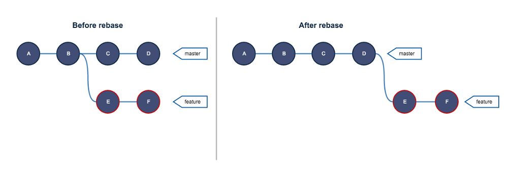
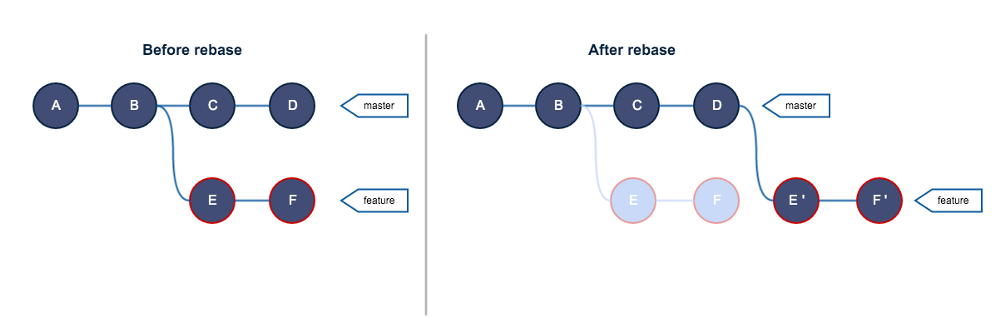
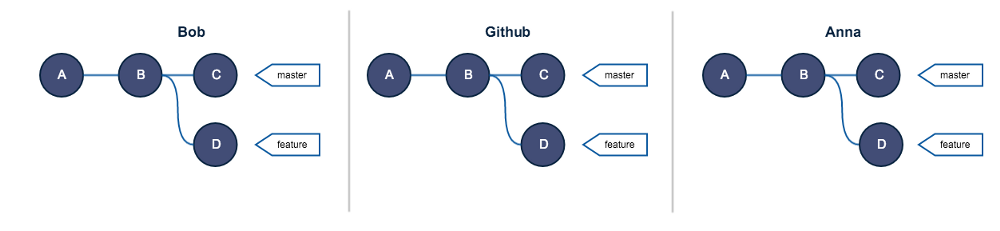
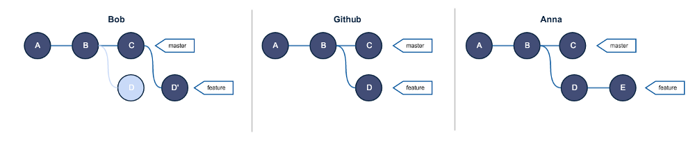
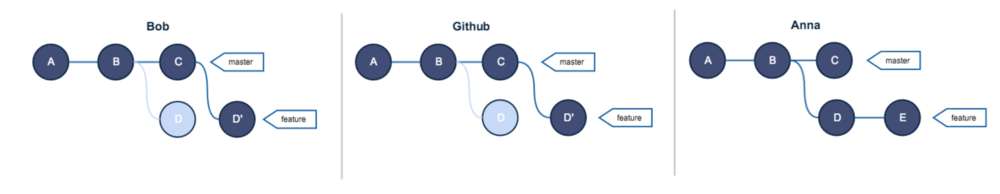
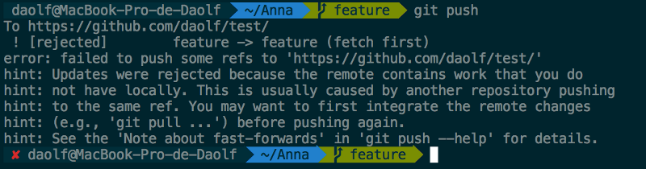
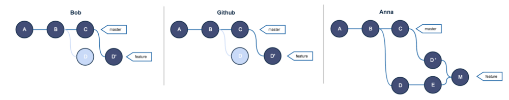
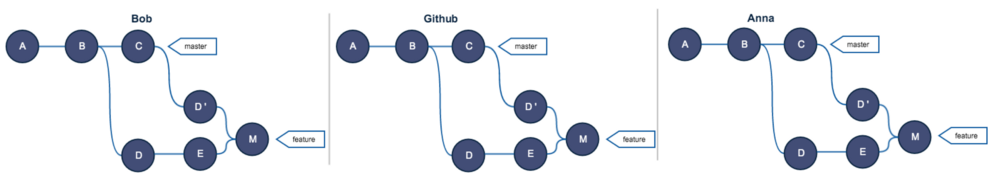
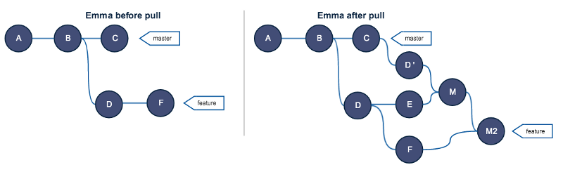

## [Git rebase and the golden rule explained.](https://medium.freecodecamp.com/git-rebase-and-the-golden-rule-explained-70715eccc372)

修改自[Git Rebase原理以及黄金准则详解](https://segmentfault.com/a/1190000005937408)

本文主要介绍git rebase时究竟执行了哪些操作，以及为什么你要关注它们。

### rebase基础
请记住下面这张图，它解释了什么是rebase：对feature分支执行rebase，就是把这个分支所有的提交从B提交上拔下来（unplug），然后把它重新插到某个分支（下图中是master分支）的顶端。通过上面的解释，rebase很容易理解，但是我们还是想深入研究一下。[官方文档](https://git-scm.com/docs/git-rebase)对rebase是这样描述的：
>“git-rebase: Forward-port local commits to the updated upstream head”— git doc



官方的描述不太好理解，我们解释一下：rebase就是把你的分支中的所有提交从另一个分支的最新提交开始，重新执行一次（reapply）。这里最重要的概念是reapply，因为rebase并不是像ctrl+x/ctrl+v一样简单的把一个分支移动到另一个分支，rebase会依次地将你所要操作的分支的所有提交应用到目标分支上。也就是说，实际上在执行rebase的时候，有两个隐含的注意点：

1. 在目的分支上重新执行源分支，会生成新的提交，也就是说即使你重放的提交与之前的一模一样Git也会将之当做新的独立的提交进行处理。
2. rebase不会删除源分支上的提交，也就是说你在对源分支执行了rebase之后，这个分支上的提交仍然会存放在.git文件夹的objects目录下。如果你对于Git是如何存放你的提交不太了解的话可以参考[这篇文章](http://bit.ly/210xGKt)

所以基于上面两个注意点，**我们可以更精确的表述rebase时真正执行的操作**：从下图可以看出，feature分支上有E、F两个新提交。对feature分支进行rebase之后，会创建新的提交E'、F'，这两个提交的内容分别和E和F是相同的，同时老的提交E、F没有被销毁，只是不能再被直接访问。一个分支只是一个指向某个提交的指针。因此如果没有分支或者tag指向某个提交，这个提交将无法再被访问，但是它会一直存在.git文件夹中。


### rebase的黄金规则
>“No one shall rebase a shared branch” — Everyone about rebase

你可能看到过这个原则，只是表述不同罢了。对于没看过这个原则的同学，它解释起来很简单，永远不要（重要的事情说三遍）对一个共享的分支执行rebase。所谓共享的分支，是指那些存在于远程仓库中的分支，并且团队中的其他人会对它进行pull。

这个原则在很多地方被作为圣经，如果你想进一步理解git，那么我认为需要理解这个原则。为了理解这个原则，我们构造一个场景，一个dev分支破坏了这个原则，然后我们看下发生了啥。

假设现在Bob和Anna在开发同一个项目，项目的远程仓库以及它们二人的仓库大概是下图这样：（Bob和Anna本地的仓库和远程仓库是同步的）


现在Bob为了图一时方便打破了原则，正巧这时Anna在特征分支上进行了新的提交：


当Bob打算推送自己的分支到远端的时候被拒绝并收到了如下的警告：


警告的原因是因为git不知道怎么合并Bob的feature分支和远程仓库中的feature分支。当你向远程仓库推送分支时，git会把你尝试推送的分支和远程仓库中相应的分支合并。也就是说git使用fast-forward来合并你的分支，具体的细节我们会在其他博客中进行讨论，简单来说，你需要记住的是远程仓库不能处理被Bob执行了rebase的feature分支。

>Usually when you push your branch on the remote, git merges the branch you’re trying to push with the branch currently on the remote. In fact git tries to fast-forward your branch, we’ll talk more about that in a future post.

Bob为了推送成功，一种可能的方法是使用`git push --force`，这个命令告诉远程仓库：不要尝试合并或者做其他任何操作，而是把远程仓库中的feature分支删除，然后以我推送的feature分支为准。执行了这个命令以后，远程仓库如下：


现在Anna想推送她的修改（Anna在feature分支上进行了一次提交E）：
错误信息很简单，git告诉Anna她本地的feature分支和远程仓库中不同步，Anna会很自然的执行git pull，同样，git pull时会尝试将你本地的分支和远程仓库中最新的分支合并。


在执行pull之前，本地和远程的feature分支分别是下面的样子：
```
A--B--C--D'   origin/feature // GitHub
A--B--D--E    feature        // Anna
```


执行pull之后，git会尝试进行一次合并，合并以后Anna本地会生成一次新的合并提交（merge commit）M，它表示这次合并操作，也就是Anna本地的feature分支与远程仓库的featuer分支最终合并点。


现在Anna解决了所有的合并冲突并且可以推送她的修改，在Bob执行pull之后，所有人的提交都是同步的：


到这里，看到上面这个混乱的提交记录图，相信你会认同rebase的黄金准则。这个混乱只是由一个人造成的，并且只是两个人共享的一个分支。考虑一下如果一个10个人的团队，造成的混乱就不可想象了。大家使用git的众多原因之一就是为了能方便的回滚，如果提交历史越混乱，回滚操作就越复杂。另外，相信你也注意到，在远端的仓库中存有大量的重复的提交，D和D'这两个提交的修改是相同的，因为D'就是在rebase时重新执行的D提交，它们占用了重复且相同的存储空间。

如果你还觉得这个黄金原则没什么，那我们来假设下还有一个同学Emma，第三个开发人员，她在本地对feature分支进行了一个提交F，然后Bob对共享分支执行了rebase，此时Emma想要推送她的修改，和Anna一样，Emma也推送失败了，她需要先执行一下pull，执行完以后，本地分支变成了下面这个样子：


更新：如Reddit的一些用户所说，这篇博客可能只是让你认为rebase只能用于把一个分支重新应用到另一个分支。实际上并不是这样，你可以在执行rebase的源分支和目的分支可以是同一个，具体的内容会在其他的地方介绍。

### 感谢阅读
我希望通过本文你更好的理解了git rebase以及它的黄金规则。如果你有任何问题和评论，请毫不犹豫的告诉我，你也可以在[twitter](http://bit.ly/1Tnqw29)上follow我。

对于受欢迎的编程语言，我会写一些关于我认为被误解或不为人所知的功能的文章并且做到深入浅出。你可能喜欢下面的文章：

* [Things you should know about JS events](http://bit.ly/1U9z7q0)
* [Understanding git for real by exploring the .git directory](http://bit.ly/210xGKt)

下一次我们继续讨论`git rebase`的高级话题，下次见，祝愉快。