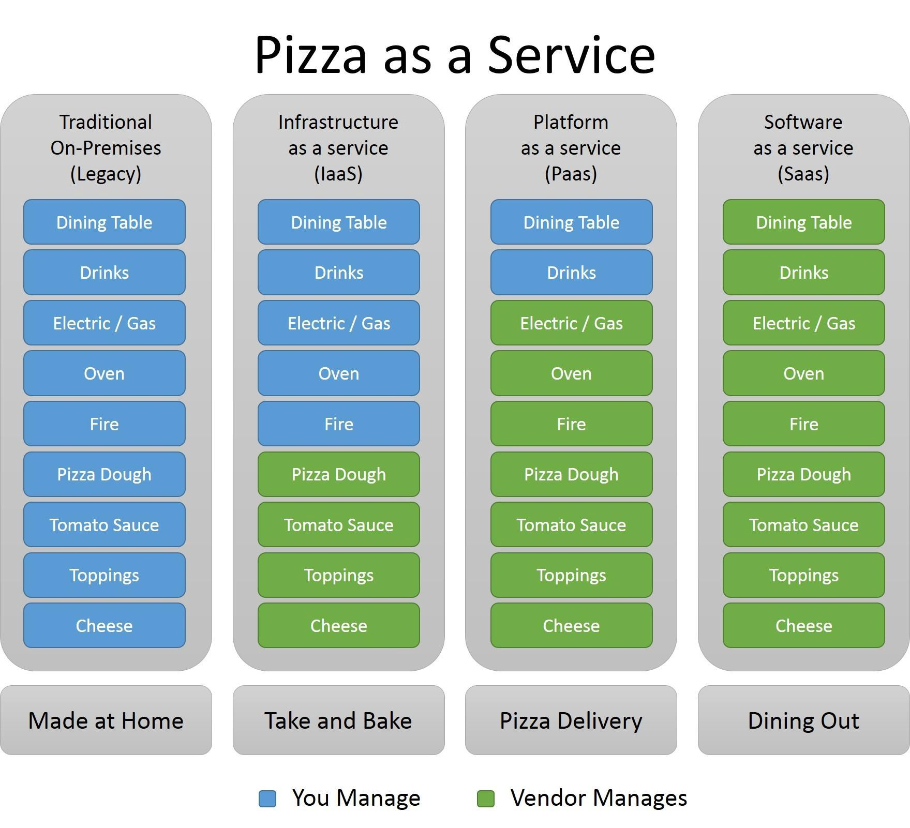
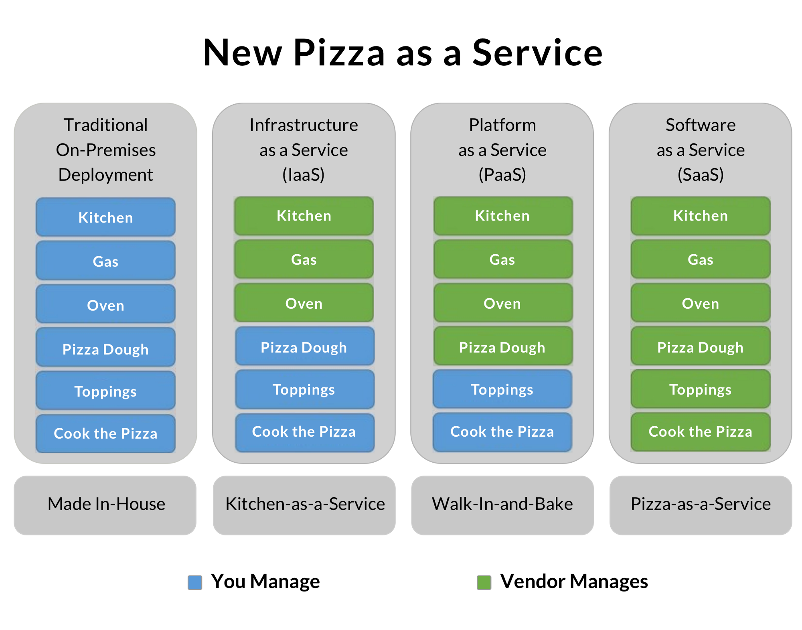
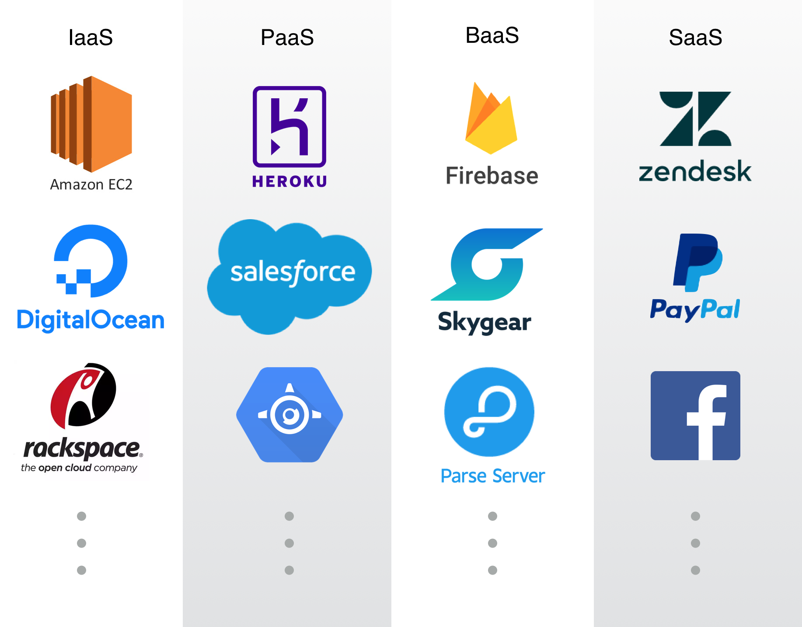

## [SaaS, PaaS and IaaS explained in one graphic](https://m.oursky.com/saas-paas-and-iaas-explained-in-one-graphic-d56c3e6f4606)

And how the original Pizza-as-a-Service illustration is wrong.

Pizza-as-a-Service比喻是[Alert Barron在2014年](https://www.linkedin.com/pulse/20140730172610-9679881-pizza-as-a-service)首先提出的，它形象的表示了Infrastructure-as-a-service (IaaS)、Platform-as-a-service (PaaS)和Software-as-a-service (SaaS)的区别。乍看这个比喻很精妙，但是如果你细细分析一下，这个比喻中很多概念难以构成体系（原文：it falls apart）。下面这张图想表现的原意是（从IaaS到SaaS）你需要做的东西越来越少，图中按照“不能外包”到“能外包”的顺序列出了制作Pizza所需的元素（译者注；指的是Dining Table、Drinks、Electri/Gas等），但是这些元素不能比较的。我会针对原图中的服务为那些想从中选择它们的用户提供更好的比较建议。

>This diagram wants to illustrate that you need to do less and less, but the items that are listed and increasingly “outsourced” don’t fit the comparison. I’ll look at the services in the original diagram and suggest a better comparison for people who want to choose which services to use. 

### A good visualization of a false concept.

Pizza-as-a-Service想表示的基本概念是：每种方式你都能获得一份Pizza，有些方式中你需要从头到尾自己做，但是有些方式中你可以让别人帮你完成。

* Traditional On-Premises Deployment: Made at Home
* Infrastructure-as-a-Service: Take and Bake
* Platform-as-a-Service: Pizza Delivery
* Software-as-a-Service: Dining out

图中你需要完成的工作量从大到小为：Made at home > Take and bake > Pizza delivery > Dining out

首先我们先看前两种方式：如果“Traditional On-Premises Deployment”表示“Made at home”，为什么“Infrastructure-as-a-Service”表示“Take and bake”？

乍看起来，Iaas好像是服务提供商卖给你已经预制作好的Pizza，所以你只要在自己家里的厨房烤好就行，不会因为制作过程把厨房搞的一团糟。然而，这不是“Infrastructure-as-a-Service”和“Traditional On-Premises Deployment”的区别所在。

### The X-aaS concept should be interpreted the other way round.

我们不妨换个方式不再从“用户需要的工作越来越少”的角度考虑，我们考虑一个可以定制化的产品，服务提供商通过不断减少帮用户做的工作来增加产品的可定制性。

在X-aaS这个概念中，你不需要担心X具体表示什么，它可以是基础设置、平台、软件或者是Pizza。我将会逐步分析如何得到一个可定制程度逐渐增加的Pizza，而不是直接把X-aaS模型生搬硬套到实际生活中的能够获得一份Pizza的方式上。

### Enjoy your packaged meal: Pizza-as-a-Service.
Pizza-as-a-Service means you can enjoy a pizza (a fully finished product) upon order. You call the pizza delivery so the pizza is already designed, prepared and baked by somebody else and arrives hot and ready to eat.

In the world of SaaS, we only need to sign up to use the service. We can customize some features, layouts, or users (pizza toppings), but we never need to worry about the deployment and framework the project is used (just like how the service providers put our orders together for us). It also means we can’t choose this brand of cheese over that, or how long they choose to bake it for. If you don’t like their crust, you’ll have to choose another company.
 
So what should be the service layer right below Pizza-as-a-Sevice?

### Semi-customized: Ready-to-cook.
The idea of “take-and-bake” in the original diagram was close, but it misses a few key ideas. The take-and-bake doesn’t allow customization, which is what IaaS and PaaS offer. IaaS and PaaS take care of some backend things you don’t want to deal with, and probably come with API’s, but you choose what you can add.

Instead of a “take-and-bake”, the next level down is more like walking into a kitchen with a ready-to-cook package of ingredients. IaaS and PaaS are when you want to make your own pizza, but you don’t need to worry about buying ingredients, prep work, or having the right tools. You can focus on rolling out the dough, assembling the pre-washed ingredients to your taste and factors like size and thickness before sticking it into someone’s provided oven.

If you use IaaS or PaaS, you can focus on your own business logic and implement your user interface on a reliable platform. The service provider manages the hosting and hardware technologies for you.

This option might not be suitable for every end-user. At least you need some pizza-making skills to turn the dough into a pizza.

### Fully customized: Kitchen-as-a-Service.
Kitchen equipment is infrastructural investment. For engineers, this is where your code runs. It also includes all the infrastructure you need (such as runtime, storage, networking). Without it, your product doesn’t go anywhere, but on the other hand, it doesn’t affect the nature of the product itself.
For a pizza, the next layer below is buying your own ingredients to prepare exactly the pizza you want, with the specific brands you like. But you don’t have to worry about the oven, rolling pin, whether you counter is big enough, or the pizza cutter.
 
Now, you have absolute control on what pizza you are going to make, but maybe the rental kitchen doesn’t have every type of tool you want.

### Fully in-house: Prepare ingredients + cooking equipment from scratch.
For hard core pizza makers — not only will you want to choose all your pizza ingredients and make it from scratch, you will also want complete control of all the tools in your kitchen: the oven that has the exact settings and capabilities you want, the pizza stone many places don’t have, or let your dough sit overnight at the most optimal corner of your fridge. And finally, you can drizzle that homemade chilli oil on top and savor it fresh out of the oven.

You may think that’s overkill — but in real world, sometimes the effort is necessary if you can’t find a service that will let you customize for that one essential deployment setting, such as a firewall configuration or that specific network setting requirements.

### Examples of IaaS, Paas, and SaaS.

SaaS (Software-as-a-Service)：你可以注册并且直接使用软件，例如：[Zendesk](http://zendesk.com/)，Paypal，甚至是其他更面向用户的软件Twitter、Fackbook、Instagram。

PaaS (Platform-as-a-Service)：你可以在平台上构建你的软件，例如：[Heroku](http://heroku.com/)，[SalesForce](http://force.com/)，Google App Engine。除此以外，你还可以利用市场上的Backend-as-a-Service（原文：you can also leverage the benefits from some Backend-as-a-Service in the market.），例如：[Skygear](http://skygear.io/)，Firebase，Kii，Kiney。

IaaS (Infrastructure-as-a-Service)：为你的App部署提供场地（虚拟机），例如：[Amazon Web Service EC2](https://aws.amazon.com/ec2/)，Digital Ocean，RackSpace Cloud。

On-Premises Deployment：你有自己的数据中心和服务器，它们完全可以根据你的需求定制。

Iaas和Pass帮我们省去了很多准备工作，所以我们可以定制我们的“Pizza”，然后很快的烘焙出来。最适合你的产品的服务类型就是最好的。希望这些例子解释清楚了这些概念。
