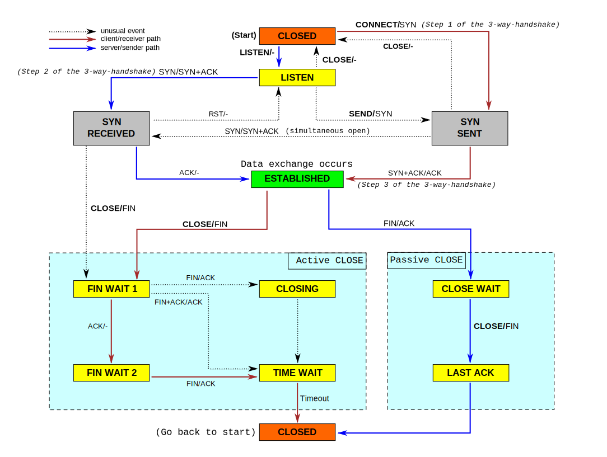

## [TCP client self connect](http://sgros.blogspot.com/2013/08/tcp-client-self-connect.html)

[这篇博客](http://goodenoughsoftware.net/2013/07/15/self-connects/)描述了一个难以预料的很酷的问题，但通过本文的分析，这个问题没有任何特殊的地方。首先执行下面的shell脚本：
```bash
while true
do
   telnet 127.0.0.1 50000
done
```

脚本首先总是会输出`Connection refused`，但是当连接建立起来以后，不论你输入什么，都会被回显。
```
Trying 127.0.0.1...
telnet: connect to address 127.0.0.1: Connection refused
Trying 127.0.0.1...
telnet: connect to address 127.0.0.1: Connection refused
Trying 127.0.0.1...
telnet: connect to address 127.0.0.1: Connection refused
Trying 127.0.0.1...
telnet: connect to address 127.0.0.1: Connection refused
Trying 127.0.0.1...
Connected to 127.0.0.1.
Escape character is '^]'.
test1
test1
test2
test2
```

注意，我们并没有启动任何的服务器，也就是说没有进程监听`localhost:50000`，然而却建立了TCP连接。通过`netstat`命令的输出我们发现确实建立了连接：
```
$ netstat -tn | grep 50000
tcp    0   0 127.0.0.1:50000  127.0.0.1:50000  ESTABLISHED
```

并且，如果我们用`tcpdump`抓网络数据包的话，我们可以观察到三次握手：
```
21:31:02.327307 IP 127.0.0.1.50000 > 127.0.0.1.50000: Flags [S], seq 2707282816, win 43690, options [mss 65495,sackOK,TS val 41197287 ecr 0,nop,wscale 7], length 0
21:31:02.327318 IP 127.0.0.1.50000 > 127.0.0.1.50000: Flags [S.], seq 2707282816, ack 2707282817, win 43690, options [mss 65495,sackOK,TS val 41197287 ecr 41197287,nop,wscale 7], length 0
21:31:02.327324 IP 127.0.0.1.50000 > 127.0.0.1.50000: Flags [.], ack 1, win 342, options [nop,nop,TS val 41197287 ecr 41197287], length 0
```

究竟发生了什么？简而言之，现象看起来是客户端和自己建立了连接。下面会详细解释其中的前因后果。

首先，当客户端（这里就是telnet程序）创建套接字并尝试连接到服务器时，内核会给套接字分配一个随机源端口，这是因为每个TCP连接都通过一个4元组唯一标识：
```
(source IP, source port, destination IP, destination port)
```

在本文的问题中，有三个参数是确定的：源IP、目的IP、目的端口，源端口是任意的，具体来说是由内核从[临时端口](http://en.wikipedia.org/wiki/Ephemeral_port)范围中分配的。当然应用程序可以通过`bind(2)`系统调用选择源端口，但是很少这么做。那么随机端口的范围是多少？通常随机端口值很高，Linux机器通过`/proc`中的文件可以看到具体数值：
```
$ cat /proc/sys/net/ipv4/ip_local_port_range
32768 61000
```

在本文的问题中，随机端口范围是32768-61000。现在回到原来的telnet程序的问题中，当telnet启动时，内核从临时端口范围中选择一个空闲的随机端口，然后尝试连接`localhost:50000`。因为没有进程监听这个端口，所以返回了RST报文，telnet客户端输出错误信息`Connection refused`，通过`tcpdump`工具可以看到网络交互：
```
# tcpdump -nni lo port 50000
21:31:02.326447 IP 127.0.0.1.49999 > 127.0.0.1.50000: Flags [S], seq 1951433652, win 43690, options [mss 65495,sackOK,TS val 41197286 ecr 0,nop,wscale 7], length 0
21:31:02.326455 IP 127.0.0.1.50000 > 127.0.0.1.49999: Flags [R.], seq 0, ack 387395547, win 0, length 0
```

有一点值得提到的是Linux是顺序选择临时端口，而不是随机选择。这样就很容易猜到内核分配的随机端口，这可能是个安全问题，需要更多的研究来确认这一点。

不论Linux如何分配临时端口，再经过多次连接失败以后，telnet客户端被分配了源端口50000，此时SYN请求被发送到目的端口50000，也就是它自己，因此就建立了自己到自己的连接。这是严格遵循[TCP协议](https://tools.ietf.org/html/rfc793)，因为TCP支持同步打开特性，在[RFC793](http://tools.ietf.org/html/rfc793)的图8中说明了这个特性，[RFC1122-4.2.2.10](http://tools.ietf.org/html/rfc1122)是RFC793图8的勘误。

然而RFC793中的例子假定同步打开的两个端点的IP:PORT是独立的，但是在我们的问题中，两个端点IP是不同的，所以和规范描述中的行为有所不同，下面具体分析一下，首先是维基百科中的[TCP状态转移图](https://en.wikipedia.org/wiki/Transmission_Control_Protocol)



telnet客户端启动时被分配的源端口是50000，TCP状态机被创建并且被初始化为CLOSED状态。然后，telnet客户端向目的端口50000的服务器建立连接，也就是发送SYN报文并转换为SYN SENT状态。因为服务器的端口和客户端端口相同，向目的端口发送的SYN报文实际上被源端口接收，因此telnet客户端因为接收到SYN报文进入SYN RECEIVED状态，同时向源端口50000回复SYN+ACK报文。下面我们结合内核中TCP/IP的代码分析一下状态机在这种情况下是如何转换为ESTABLISHED状态以及最后一次握手的ACK报文是如何发送的。

1. 注意内核代码中显式指出了[自连接的情况](http://lxr.linux.no/linux+v3.10.5/net/ipv4/tcp_input.c#L5525)了，并对它做了[注释](http://lxr.linux.no/linux+v3.10.5/net/ipv4/tcp_input.c#L5528)
2. 自连接是被TCP_SYN_SENT状态触发的，然后套接字被[设置为TCP_SYN_RECV状态](http://lxr.linux.no/linux+v3.10.5/net/ipv4/tcp_input.c#L5530)并[发送SYN+ACK](http://lxr.linux.no/linux+v3.10.5/net/ipv4/tcp_input.c#L5557)
3. 因为源端口和目的端口相同，SYN+ACK被回环接收到，然后被[tcp_rcv_state_process()处理](http://lxr.linux.no/linux+v3.10.5/net/ipv4/tcp_input.c#L5597)，首先调用了[tcp_valid_incoming()](http://lxr.linux.no/linux+v3.10.5/net/ipv4/tcp_input.c#L4982)，这个函数经过若干检查，最终[调用](http://lxr.linux.no/linux+v3.10.5/net/ipv4/tcp_input.c#L5039)了[tcp_send_challenge_ack()](http://lxr.linux.no/linux+v3.10.5/net/ipv4/tcp_input.c#L3254)发送ACK。
4. 在tcp_rcv_state_process()函数[处理ACK标志的代码片段](http://lxr.linux.no/linux+v3.10.5/net/ipv4/tcp_input.c#L5674)中[把TCP状态机设置为ESTABLISHED](http://lxr.linux.no/linux+v3.10.5/net/ipv4/tcp_input.c#L5701)，这样就解释了自连接是如何发生的，以及网络协议栈中实际发生了什么

本文描述的自连接场景是很特殊的，需要在特定的条件下才能触发：

1. 滥用临时端口作为监听端口，客户端向监听在临时端口的服务器建立连接
2. 客户端和服务器的IP相同（否则也不会导致自连接）
3. 只有TCP连接建立的握手阶段才可能导致自连接，如果你遇到客户端向临时端口建立TCP连接的情况，*you'll be refused实在不知道咋翻译*

>Finally, this can only happen during initial handshake phase. If you find some client using some ephemeral port and try to connect to it, you'll be refused. 

所以，本文的结论是：不要使用临时端口作为服务器监听端口，否则你很可能遇到看起来很诡异、不确定的现象，并且难以调试。

