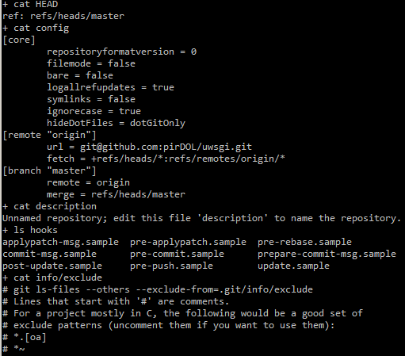

## [Understandinggitforrealbyexploringthe .gitdirectory](https://medium.freecodecamp.com/understanding-git-for-real-by-exploring-the-git-directory-1e079c15b807)

修改自[探索.git目录，让你真正了理解git](http://blog.jobbole.com/98634/)

>“哇偶，我才读了git的快速入门指南就觉得它简直酷毙了，现在使用起git来感觉超舒服，妈妈再也不担心我会捅出什么篓子了。” ——某位无名英雄曾曰过

新人刚使用git的时候，就像去到一个既不识当地文字也不会说当地语言的陌生的国家。只要你知道你在什么地方、要去哪里，一切都OK，而一旦你迷路，麻烦就来了。

网上已经有许多关于学习基本的git命令的文章，但是本文不属于这一类，而是尝试另辟蹊径。


新手总是被git吓到，事实上也很难不被吓到。可以肯定的是git是很强大的工具但还不够友好。大量的新概念，有些命令用文件做参数和不用文件做参数各自执行的动作截然不同，还有隐晦的回馈等…

我以为克服第一道难关的方法就是不仅仅是使用gitcommit/push就完了。如果我们花点时间去真正了解到底git是由什么构造的，那将会省去不少麻烦。

### 初探.git

那么我们开始吧。当你创建一个仓库的时候，使用gitinit指令，git将会创建一个神奇的目录：.git。这个目录下包含了所有git正常工作所需要的信息。说白一点，如果你想从你的项目中删除git但是又要保留项目文件，只需要删除 .git文件夹就可以了。但是，你确定要辣么做？

```
├──HEAD
├──branches
├──config
├──description
├──hooks
│ ├──pre-commit.sample
│ ├──pre-push.sample
│ └── ...
├──info
│ └──exclude
├──objects
│ ├──info
│ └──pack
└──refs
 ├──heads
 └──tags
```


这就是你第一次提交之前.git目录的样子：

*HEAD：这个我们稍后会讨论
*config：这个文件包含你的代码库的配置信息，例如这里会保存远程仓库的URL，你的email地址，你的用户名等。每次你在控制台使用`git config`命令时修改的就是这里的内容。
* description：gitweb（可以说是github的前身）用来显示仓库描述的文件
* hooks：这是一个有意思的特性。Git提供了一系列的脚本，可以在每一个有实质意义的git阶段让它们自动运行。这些可以在commit、rebase、pull等阶段 的之前、之后运行的脚本叫hook。脚本的名字表示它什么时候被运行。例如，在push之前运行的脚本通常是代码风格检查，用于和远程仓库保持一致。
* info/exclude：你可以把你不想让git处理的文件放到.gitignore 文件里。info/exclude文件也有同样的作用，**不同的地方是它不会被共享**，比如当你不想跟踪你的IDE相关的配置文件时，即使通常情况下.gitignore 就足够了（如果你用到了这个请在评论中告诉我）。

【译者注】貌似info/exclude就是不会被推送到远程仓库的.gitignore文件，后者是代码库的一部分，会被推送到远程仓库。另外用我自己fork的uwsgi为例，打印了上面文件的内容：


### commit中包含什么
**每一次你创建一个文件并将它添加到版本控制中，git会对其进行压缩然后以git内部的数据结构存储。这个压缩的对象会有一个唯一的名字，即一个哈希值，这个值存放在 object目录下**。

在探索object目录前，我们先要问自己什么是commit。commit 大致可以视为你工作目录的快照，但是它又不仅仅只是一种快照。实际上，当你提交时，为创建你工作目录的快照 git只做了两件事（这里只是简单介绍，整个过程有一点复杂，以后的博客里会作说明的）：

1. 如果这个文件没有改变，git仅仅只把压缩文件的名字（就是哈希值）放入快照。
2. 如果文件发生了变化，git会把压缩后的文件存入object目录，然后再把压缩文件的名字（哈希值）放入快照。

创建好快照以后（快照本身也是一个文件），快照也会被压缩并且以一个哈希值命名。那么所有的压缩对象都放在哪里呢？答案是object目录。

这就是我创建一个空文件file_1.txt并提交以后object目录的样子。请注意如果你的文件的哈希值是`4cf44f1e...`，git会把这个文件存在object目录的`4c`子目录下的`4cf44f1e...`文件。这样做可以控制object目录中最多只有256个子目录。
```
├── 4c
│ └── f44f1e3fe4fb7f8aa42138c324f63f5ac85828 // hash
├── 86
│ └── 550c31847e518e1927f95991c949fc14efc711 // hash
├── e6
│ └── 9de29bb2d1d6434b8b29ae775ad8c2e48c5391 // hash
├── info // let's ignore that
└── pack // let's ignore that too
```

object目录下有3个哈希值。其中一个是file_1.txt ，另一个是提交时所创建的快照文件。那么第三个是什么呢？因为commit 本身也是一个对象，所以压缩后也存放在object目录下。

**现在，你需要记住的是一个commit包含四个部分：**

1. 工作目录快照的哈希（【译者注】我理解就是git add的文件）
2. 提交的说明信息
3. 提交者的信息
4. 父提交的哈希值

如果我们解压缩一个提交，你自己可以看看到底是什么：
```
// by looking at the history you can easily find your commit hash
// you also don't have to paste the whole hash, only enough 
// characters to make the hash unique
git cat-file -p 4cf44f1e3fe4fb7f8aa42138c324f63f5ac85828
```

这是我看到的：如你所见我们得到了所期望看到的内容：快照文件的哈希值，提交者，提交说明。这里有两样东西很重要：

1. 正如预料的一样，快照文件的哈希值`86550...` 也是一个对象并且能在object目录下找到。
2. 因为这是我的第一个提交，所以没有父提交。

```
tree 86550c31847e518e1927f95991c949fc14efc711
author Pierre De Wulf <test@gmail.com> 1455775173 -0500
committer Pierre De Wulf <test@gmail.com> 1455775173 -0500
commit A
```

同理，用`git cat-file -p`命令打开快照文件，看看它的内容：
```
git cat-file -p 86550c31847e518e1927f95991c949fc14efc711
100644 blob e69de29bb2d1d6434b8b29ae775ad8c2e48c5391 file_1.txt
```

第一次提交后，object文件夹中有三个对象，`4c`是提交文件（**就是git log中看到的哈希值**），`86`是这次提交的快照文件，`e6`就是这次提交真正提交的内容file_1.txt。这样object目录中的三个对象就都清楚了。file_1.txt的类型是blob，它表示二进制文件，这里不具体展开了。

【译者注】
1. blob文件可以通过`git cat-file blob`打印内容
1. 我执行`git cat-file -p`命令遇到了`fatal: Not a valid object name`错误，原因很二，因为哈希值的前两位作为object目录的子目录名字，然后子目录中的对象文件名就不是完整的哈希值了，省略了前两个字节。
```
├── .git
| └── object
│   └── 4c
│     └── f44f1e3fe4fb7f8aa42138c324f63f5ac85828 // hash值为4cf44f1e3fe4fb7f8aa42138c324f63f5ac85828
```

实际执行例子：
```
+ rm -rf .git
+ git init
Initialized empty Git repository in D:/work/github/gitlearn/.git/
+ echo 'hello git'
+ git add file.txt
warning: LF will be replaced by CRLF in file.txt.
The file will have its original line endings in your working directory.
+ git commit -m init
[master (root-commit) 3161627] init
warning: LF will be replaced by CRLF in file.txt.
The file will have its original line endings in your working directory.
 1 file changed, 1 insertion(+)
 create mode 100644 file.txt
++ git log
++ head -1
++ awk '{print $2}'
+ commit=316162762637701ecabae02beb324e1e567d1caa
+ git cat-file -p 316162762637701ecabae02beb324e1e567d1caa
tree c8bcfef1da123a980537a5fa4cf9b7c4f387d451
author liduo04 <pirdol@qq.com> 1498291878 +0800
committer liduo04 <pirdol@qq.com> 1498291878 +0800

init
++ git cat-file -p 316162762637701ecabae02beb324e1e567d1caa
++ head -1
++ awk '{print $2}'
+ snapshot=c8bcfef1da123a980537a5fa4cf9b7c4f387d451
+ git cat-file -p c8bcfef1da123a980537a5fa4cf9b7c4f387d451
100644 blob 8d0e41234f24b6da002d962a26c2495ea16a425f    file.txt
++ git cat-file -p c8bcfef1da123a980537a5fa4cf9b7c4f387d451
++ head -1
++ awk '{print $3}'
+ file=8d0e41234f24b6da002d962a26c2495ea16a425f
+ git cat-file blob 8d0e41234f24b6da002d962a26c2495ea16a425f
hello git
+ cat file.txt
hello git

```

```bash
#!/bin/bash
set -x
rm -rf .git
git init
echo "hello git" >file.txt
git add file.txt
git commit -m "init"

commit=`git log | head -1 | awk '{print $2}'`
git cat-file -p ${commit}

snapshot=`git cat-file -p ${commit} | head -1 | awk '{print $2}'`
git cat-file -p ${snapshot}

file=`git cat-file -p ${snapshot} | head -1 | awk '{print $3}'`
git cat-file blob ${file}

cat file.txt

```

### branch、tags、HEAD都是一回事
那么现在你知道git的每一个对象都可以通过相应的哈希值访问。现在我们来看看HEAD 吧，HEAD里又有什么呢？
```
cat HEAD
ref: refs/heads/master
```

看起来HEAD不是一个哈希值，这容易理解，因为HEAD可以看作一个你目前所在分支的指针。如果我们看看refs/heads/master就知道了：
```
cat refs/heads/master
4cf44f1e3fe4fb7f8aa42138c324f63f5ac85828
```

是不是很熟悉？这和我们第一个提交的哈希值完全一样。**由此表明分支和标签就是一个提交的指针**。明白这一点你就可以删除所有你想删除的分支和标签，但它们指向的提交依然在代码库中，（但是这些没有被branch或者tag指针指向的提交）就难以被访问到了，如果你想了解如何访问它们，请参考[git book](https://git-scm.com/book/en/v2/Git-Internals-Git-Objects)。

### 尾声
到目前为止你应该了解：git 所做的事就是当你提交的时候“压缩”当前的工作目录，连同其他一些信息一并存入 objects目录。但是如果你足够了解 git 的话，你就能完全控制提交时哪些文件应该放进去而哪些不应该放。

我的意思是，一个提交并非真正意义上是一个你当前工作目录的快照，而是一个你想提交的文件的快照。那么在提交之前git把你想提交的文件放在哪里？git会把它们放在index 文件里。我们现在不会去深入探究index，如果你确实好奇你可以参考[这里](https://github.com/git/git/blob/master/Documentation/technical/index-format.txt)。

### 感谢阅读
我希望通过本文你更好的理解了git的核心概念。如果你有任何问题和评论，请毫不犹豫的告诉我，你也可以在[twitter](http://bit.ly/1Tnqw29)上follow我。

对于受欢迎的编程语言，我会写一些关于我认为被误解或不为人所知的功能的文章并且做到深入浅出。你可能喜欢下面的文章：

* [Things you should know about JS events](http://bit.ly/1U9z7q0)
* [Git rebase and the golden rule explained](http://bit.ly/1UrDsVF)

下一次我们谈谈`git rebase`，下次见，祝愉快。
