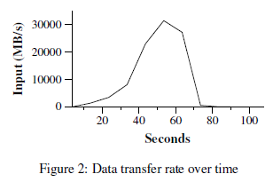

## 摘要
MapReduce是一种编程模型，是大数据集合的处理和生成的相关实现。用户指定一个map函数，它将一个K/V对处理生成一个中间结果的K/V对集合；以及一个reduce函数，它将中间结果中所有key相同的K/V对的value进行合并。如本文所展示的那样，真实世界中许多任务都可以用这种模型来表示。

用MapReduce这种函数式风格编写的程序是天然并行的，从而运行在大规模的商用计算机集群上。运行时系统负责处理一些细节，诸如：输入数据划分、在一组机器上调度程序的执行、处理宕机问题以及管理机器之间必须的通信。这使得没有任何并发编程、分布式系统经验的程序员可以容易的使用大规模分布式系统的资源。

我们实现的MapReduce运行在一个大规模的商用计算机集群上，这个集群是具有高伸缩性：一个典型的MapReduce计算会在处理上千台机器上许多TB的数据。程序员可以很容易的使用这个系统：几百个MapReduce程序已经被实现，并且每天Google的集群上执行的MapReduce任务数高达上千个。

## 1 简介

在过去的五年中，本文的作者们和Google的其他同事实现了几百个特定作用的计算，这些计算用于处理大量的原始数据，比如：抓取文档、网页请求日志等，并计算得到不同种类的衍生数据，比如：倒排索引、网页文档图结构的不同表达形式、每个主机抓取网页数量的概要、某天中频率最高的查询请求等。这些计算中的大多数从概念上看是简单的，然而输入的数据通常会很大，计算不得不分布在成百上千的机器上以保证能够在合理的时间内完成。如何并行计算、如何分布数据以及如何处理宕机这些问题汇集在一起导致了原本简单的问题变得复杂，不得不写大量的复杂的代码处理这些问题。

为了处理这个复杂性，我们设计了一个新的抽象，它允许我们表达简单的问题，并且将并行、容错性、数据分布、负载均衡这些复杂的细节隐藏在一个程序库中。我们的抽象源自于Lisp以及其他函数式语言中的map和reduce原语。我们意识到大多数计算都涉及到：对输入数据中的每个“逻辑记录”进行map操作，目的是获得用于计算的中间结果K/V对的集合；对key相同的所有中间结果的value进行reduce操作，目的是以适当的方式合并中间结果。我们使用的这一函数模型使得：容易实现并行的进行大规模的运算，并且可以使用重试作为主要的容错机制。

这项工作的主要贡献是提出了一个简单并且强大的接口，它实现了大规模计算的自动化并发和分布式，这个接口的实现在大规模的商用计算机集群上可以达到很高的性能。
本文第2部分描述了基本的编程模型并给出了几个例子。第3部分描述了一个针对我们的基于集群的计算环境实现的MapReduce接口。第4部分描述了对这一编程模型的一些很有作用的改良。第5部分通过一些列不同的任务测试了我们实现的接口的性能。第6部分探索了MapReduce在Google的使用，包括我们基于它来重写我们的索引系统的经验。第7部分讨论了相关的以及未来的工作。

## 2 编程模型
MapReduce的计算过程就是由输入的K/V对集合生成输出K/V对集合。MapReduce库的用户把计算过程表达为两个函数：Map和Reduce。

Map：由用户编写，根据输入的一个K/V对生成一组中间结果K/V对。MapReduce库负责将key相同的中间结果的value汇集在一起并把它们传递给Reduce函数。

Reduce：也是由用户编写，接收中间结果的key和以这个key为键的所有中间结果的value的集合。Reduce函数合并这些value，产生一个更小的value集合。最典型的Reduce调用是输出0个或1个值。中间结果通过迭代器的方式提交给用户的Reduce函数，避免了当中间结果的value集合比较大时无法将它们全部装入内存。

### 2.1 例子
考虑一个问题，给定一个大规模的文档集合，统计每个单词的出现次数。用户会写出类似下面的伪代码：
```
map(String key, String value):
  // key: document name
  // value: document contents
  for each word w in value:
  EmitIntermediate(w, "1");

reduce(String key, Iterator values):
  // key: a word
  // values: a list of counts
  int result = 0;
  for each v in values:
    result += ParseInt(v);
  Emit(AsString(result));
```
  
map函数发送每个单词外加它的出现次数（对于这个例子，出现次数就是1）。reduce函数把同一个单词的所有被发送的出现次数加起来。

另外，用户向一个mapreduce specification对象填写代码实现配置输入输出文件以及其他可选的整定参数。然后用户调用MapReduce函数，把mapreduce specification对象传递给它，最后用户的代码和MapReduce程序库链接起来。附录A包含这个例子完整的代码。

### 2.2 类型
尽管前面的伪代码中输入输出都是字符串，但是从概念上说用户提供的map和reduce函数有相关的类型：
```
  map (k1,v1) -> list(k2,v2)
  reduce (k2,list(v2)) -> list(v2)
```

也就是说，输入的K/V对是从与输出K/V对不同的域中获得的，此外输出K/V对和中间结果K/V对来自同一个域。

我们的C++实现传递string到用户自定义的map函数，由用户代码负责实现从string到合适类型的转换，同理reduce函数要将中间结果从合适的类型转换成string以便于输出。

### 2.3 更多的例子
下面是一些有趣的程序案例，它们可以简单的表达为MapReduce计算。

* 分布式grep：map函数发送某一行是否和模式串匹配，reduce函数是一个恒等函数，仅仅是把中间结果输出。
* 统计URL访问频率：map函数处理网页请求日志发送(URL,1)，reduce函数把URL相同的所有的中间结果的value都加起来，发送一个(URL,total_count)就是输出。
* 反转网页链接图：已知从source页面可以找到target这个URL，map函数发送(target,source)。reduce函数把同一个target的所有source连接起来，发送(target,list(source))。
* 每个主机的词条向量：词条向量以“单词，频率”的形式概括了一个文档或者一个文档集合中最重要的单词。map函数发送(hostname,term vector)（输入一个文档，从文档的URL上提取出主机名，从文档中获取词条向量），reduce函数把hostname相同的所有不同文档的词条向量按照频率合并，然后丢掉不常见的词条，得到最终的(hostname,term vector)。
* 倒排索引：map函数分析每个文档，发送一系列(word,document ID)，reduce函数把某个word的所有(word,document ID)都接收过来，把document ID排序，发送(word,list(document ID))作为结果。所有的输出构成了简单的倒排索引，很容易对这个计算进行扩展用于实现查找单词的位置。
* 分布式排序：map函数从每个记录上提取key，发送(key,record)。reduce函数原封不动的发送所有<key,record>对。这个计算依赖于4.1节中描述的划分功能以及4.2节中描述的排序特性。

## 3 实现
MapReduce接口有许多不同的可能实现。选择哪一种取决于环境。例如：有些实现可能更适合于共享内存的小机器，有些实现适用于NUMA（非均匀访问模型）的多核机器，有些实现适用于大规模的通过网络连接的机器集群。

这一节描述针对于Google中广泛应用的计算环境：大规模的商用PC机集群，机器之间通过以太网交换机相连接。在我们的环境中：
1. 机器的典型配置是双核x86处理器，运行Linux系统，每台机器2-4GB内存。
2. 使用商用网络的硬件，每台机器的典型带宽为100Mbps或者1Gbps，但是全局平均带宽会比机器的带宽低。
3. 集群由成百上千的机器组成，因此机器出现故障是很常见的。
4. 每台机器上使用廉价的IDE磁盘实现存储。我们开发了一个分布式文件系统用于管理存储在这些磁盘上的数据。该文件系统使用冗余实现了硬件不可靠的前提下的系统可用性以及可靠性。
5. 用户提交工作到调度系统中，每个工作都由一个任务集合组成，任务集合被调度器映射到集群中一组可用的机器上。

### 3.1 实现概览
输入数据被自动划分成M个分片组成的集合，从而map函数可以分布在多台机器上调用。输入的分片因此可以在不同的机器上并行的处理。通过对中间结果的key的hash值取模将它们划分成R个分片（R由用户指定），从而reduce函数也可以分布在多台机器上调用。


图1展示了我们实现的MapReduce的操作流程。当用户的程序调用MapReduce函数时，下面的动作序列将会发生（下面动作序列的编号和图1中的编号对应）：

1. MapReduce函数库首先将输入的文件划分为M个分片，每个分片典型的大小是16MB或者64MB（由用户通过可选参数配置），然后程序库在集群的若干台机器上启动fork出用户程序。
2. 其中一个程序副本是很特殊，它叫做master。其他的程序副本都是worker，它们完成master安排的任务，因为有M个map任务和R个reduce任务要安排，master选择空闲的worker并且中map或者reduce中安排一个任务给它。
3. 被安排了map任务的worker读取相应的输入分片内容，从输入数据中解析出K/V对，并把它们传递给用户定义的map函数，map函数生成中间结果的K/V对并缓存在内存中。
4. 缓存在内存中的K/V对被周期性的写入本地磁盘，并被划分函数划分为R个分片。缓存的K/V对在本地磁盘上的位置会回传给master，master负责将这些位置发送给执行reduce任务的worker。
5. 当执行reduce任务的worker被master通知了中间结果的位置时，它通过RPC读取存储在执行map任务的worker磁盘上的中间结果数据。当reduce worker读取了所有的中间结果，它对中间结果按照key排序使得所有key相同的中间结果汇聚在一起。因为不同的key会被映射到同一个reduce worker（换句话说，被映射到同一个reduce worker的中间结果的key不一定相等，因为是按照hash(key)%R关系映射的），所以排序是必要的。如果中间结果的数据量太大以至于无法放在内存中，此时应该使用外排序。
6. reduce worker对排序后的中间结果进行迭代，对于中间结果的每个key，reduce worker把key以及这个key的所有的value都传递给用户定义的reduce函数。reduce函数的输出被追加到最终的输出文件上（因为reduce函数也是在多个机器上运行的，因此每个机器生成的是最终结果的一部分）。
7. 当所有的map任务和reduce任务完成以后，master唤醒用户的程序，此时MapReduce函数调用返回。

成功完成MapReduce函数的调用以后，执行结果分布在R个输出文件中（每个文件对应一个reduce worker）。用户通常不需要合并这个R个文件，只要将这些文件作为另一个MapReduce调用的输入，或者把它们作为另一个分布式应用程序的输入，因为分布式应用程序天生需要的输入就是多个文件分片。

### 3.2 matser的数据结构
master保存若干数据结构用于保存：每个map任务和reduce任务的状态（空闲、执行中和完成），非空闲任务的worker机器ID。

map任务生成的中间结果在本地磁盘上的存储位置以master作为渠道，传播到reduce任务，因此每个已完成的map任务产生的R个中间结果的磁盘位置和大小保存在master上。当map任务完成时，master会接收到更新中间结果磁盘位置和大小的消息，然后master将这些消息推送到正在执行reduce任务的worker。

### 3.3 容错性
因为MapReduce程序库是用于在成百上千的机器上处理大规模数据，因此程序库必须优雅的处理机器宕机。

#### worker故障

master周期性的ping每个worker，如果在一定时间内没有接收到worker的响应，master将这个worker标记为故障。任何被worker完成的map任务都会复位到它们初始化的空闲状态，使得这个任务可以在其他的worker上重新调度。同样，任何运行中的map任务和reduce任务在运行中遇到了worker故障，任务的状态同样被复位成空闲，使得它们可以重新被调度。

已完成的map任务如果对应的worker发生了故障也会被重新调度执行，因为map任务的结果是保存在worker本地的，因此无法访问。已完成的recude任务不需要被重新执行，因为reduce任务的输出是保存在全局文件系统中的。

当一个map任务首先被worker A执行，然后又被worker B执行（因为A故障了），所有执行reduce任务的worker都会接收到这个通知，没有读取map任务输出的中间结果的reduce任务将会直接中worker B上读取结果。

MapReduce对于大规模的worker故障有一定的弹性，例如当一个MapReduce操作执行时，由于在一个运行的集群上的网络维护一次性导致了80台计算机在几分钟内不可达，MapReduce就是简单的在不可达的机器上重试任务，直到取得进展并最终完成这个MapReduce操作。

#### master故障
很容易周期性的让master写内部数据结构的检查点，如果master任务挂了，新的master启动后恢复最近一次的检查点状态。然而考虑到只有一个master，因此master故障的概率是很低的，因此我们目前的实现中如果master故障了会终止MapReduce计算。由用户检查这个情况并在需要时重启MapReduce操作。

#### 存在故障时的语意（Semantics in the presence of failures）
只要用户提供的map和reduce操作是输入值的确定性函数，我们的分布式实现可以和无故障并且顺序执行map和reduce程序得到同样的结果。

我们依赖于对map和reduce任务原子性提交实现上述的属性。每个执行中的任务只会把输出结果写到机器私有的临时文件中：对于reduce任务，输出结果是一个文件，对于map任务，输出结果是R个文件（每个文件对应一个reduce任务）。当map任务完成时，worker会向master发送消息，消息中包括这R个临时文件的名字。当master接收到了一条任务完成消息，如果该任务已经完成并且接收过任务完成消息，这条重复的消息会被master忽略；否则，master会将R个文件的名字记录在数据结构中。

当reduce任务完成，reduce任务的worker会将输出的临时文件原子的更名为最终输出文件名。如果同一个reduce任务在不同的机器上被执行了，那么对相同的最终输出文件（只有一个）的重命名操作会被多台机器调用，我们依赖于底层的文件系统提供的原子重命名操作确保最终输出文件的状态只包含一个reduce任务执行产生的结果。

我们的map和reduce操作中的绝大多数都是确定性的，因此我们实现的MapReduce程序库的语意与顺序执行是相同的，因此这使得程序员很容易推论程序的行为。如果map和/或reduce操作是不确定的，我们提供了弱的但是仍然合理的语意。当出现非确定的操作时，对于某个reduce任务R1的输出和非确定程序的顺序执行输出是相同的，然而此时另一个reduce任务R2的输出可能对应另一个非确定程序的顺序执行结果。

考虑一个map任务M和reduce任务R1和R2，记e(R1)为R1的执行结果（假定只有一次任务提交和执行），弱语意由此出现因为e(R1)可能读取了M某次执行的输出，e(R2)则可能读取了M的另一次执行的输出。

### 3.4 本地存储
网络带宽是我们的计算环境中相对稀缺的资源，我们通过利用输入数据（由GFS管理）存储在组成我们集群的机器的本地磁盘上这一事实来节省带宽。GFS将文件划分为64MB的块并且对每个块在不同的机器上共存储若干份（通常是3）拷贝。MapReduce程序的master会将输入文件的位置信息纳入考虑，尝试在包含对应的输入数据拷贝的机器上运行map任务，即使做不到，master会尝试在保存输入数据拷贝的机器附近的机器上运行map任务（例如运行map任务的机器和保存数据的机器在同一个交换机上）。当在集群的大部分机器上运行大规模的MapReduce操作时，大部分的输入数据都是从本地读取的，因此不会消耗网络带宽。

### 3.5 任务粒度
如前文所述，我们把map阶段划分为M个分片，把reduce任务划分为R个分片。在理想情况下，M和R应该比worker机器的数量大得多，这样可以使每个worker运行不同的任务，从而有助于提高动态负载均衡，并且有助于加快worker故障时的恢复速度：许多完成的map任务可以在所有其他的worker机器上展开。

在我们的实现中，M和R是有实际的上限的，因为master必须做出O(M+R)个调度决策并且在内存中保存O(M*R)个状态，事实上内存开销的常数因子是比较小的：O(M*R)个状态大约是每个map/reduce对大约1字节数据。

另外，R通常由用户限制，因为每个reduce任务的输出是一个单独的文件。在实际应用中，M的选择应当使得输入数据被分割成16MB或者64MB的分片，以便于前面描述的本地存储优化能够达到最高效率，R通常选择worker数量的一个比较小的倍数。我们通常用于MapReduce计算的参数为M=200000/R=5000，worker机器的数量为2000。

### 3.6 备份任务
一个最常见的导致MapReduce操作运行时间增长的因素是“掉队”：某台机器花费了异常长的时间完成计算中仅剩的几个map或者reduce任务。掉队可能由多种原因导致：某台机器的磁盘坏了导致读写数据时经常进行校正，从而将30MB/s的读速度降低到1MB/s；集群调度系统在某台机器上同时执行多个任务，导致了对CPU、内存、磁盘以及网络带宽的竞争等；我们最近遇到的一个问题是机器初始化代码的bug导致了处理器缓存被禁用了，从而在这台机器上执行的计算都会收到影响，时间慢了100倍。

我们有一个基本的机制来减轻掉队的问题。当一个MapReduce操作接近完成时，master会对剩余的执行中的任务进行备份执行，如果当前正在执行的任务或者刚刚启动的后备任务有一个完成了，就认为这个任务完成了。我们整定了这个机制以便于它在通常情况下对于MapReduce操作的资源消耗的额外开销不会多于一定的百分比。我们发现这一机制能够显著的降低完成规模较大的MapReduce操作所需的时间。例如：5.3节中的排序程序在关闭后备任务机制时所需的时间增加了44%。

## 4 改进
尽管通过简单编写Map和Reduce函数实现基本功能对于大部分需求是效率足够的，但是我们发现了一些有用的扩展，本节下面就对它们进行介绍。

### 4.1 划分函数
MapReduce的用户通过R指定reduce任务也是输出文件的数量。划分函数将中间结果根据key分配到这R个reduce任务上，默认的划分函数是哈希（例如：hash(key) % R），哈希可以趋向于相对平均的划分结果。但在某些情况下，需要先用某个函数处理key以后再划分，例如：有时，中间结果输出的key是URL，但是我们想把一个主机的素有URL输出到一个文件。为了支持这个需求，MapReduce程序库的用户必须提供一个特殊的划分函数，例如使用“hash(hostname(URL)) % R”作为划分函数，它可以将同一个主机的所有URL划分到一个reduce任务上。

### 4.2 对于排序的保证
我们确保对于一个给定的划分函数，中间结果K/V对是按照key的升序被处理的。这个顺序保证了输出文件中的结果是有序的，当输出文件需要支持高效率的根据key随机访问或者输出文件的用户更倾向于使用有序的结果时，这一保证是很有用的。

### 4.3 合并函数
在某些应用场景下，每个map任务产生的中间结果K/V对中会有大量的重复，用户指定的reduce函数是可交换的、相互关联的。一个很好的例子是2.1节的单词统计，因为单词的频率符合Zipf分布，每个map任务会产生成百上千的形如(the, 1)这样的中间结果，所有这些中间结果会通过网络发送到单独的一台reduce任务机器上，然后reduce函数将相同单词的计数值累加起来得到一个结果。我们允许用户指定一个可选的合并函数，该函数在中间结果被发送到网络中之前对其进行合并操作。

合并函数在执行map任务的机器上执行，最典型的合并函数就是直接使用reduce函数的代码。二者的区别在于MapReduce程序库如何处理函数的输出：reduce函数的输出会被写入到最终的输出文件，而合并函数的输出则写入到中间文件并传递到reduce任务。

部分合并可以显著增加某些类型的MapReduce操作，附录A中的例子使用和合并器。

### 4.4 输入和输出类型
MapReduce程序库支持读取不同格式的输入数据。例如：文本模式把输入的每一行作为一个K/V对，key是该行在文件中的偏移量，value是行的内容；另一种常用的输入格式支持一系列按照key排列的K/V对。每一种输入格式的实现都需要直到如何把它们自己分割为有意义的区间，以便于能够作为独立的map任务运行，例如：文本模式区间的划分会确保在行的边界进行。用户可以添加对新的输入格式类型的支持，通过实现简单的reader接口，尽管大多数的用户仅使用一小部分的输入类型。

reader接口不一定必须从文件中读取数据，例如：还可以从数据库、内存中的数据结构中读取。

以此类推，我们支持一组输出数据的格式类型，并且用户可以自定义代码增加对新的输出类型的支持。

### 4.5 副作用
在一些应用场景中，MapReduce的用户发现很容易生成辅助文件作为map和/或reduce操作额外的输出。我们依赖于writer应用程序使得这个副作用保持原子性和幂等性。典型地，应用程序将生成的数据写入临时文件并且当数据生成完毕时，原子地将文件名修改。

我们对于单个任务产生的多个文件不提供原子性的两阶段提交，因此生成多个文件的任务如果对于跨文件的数据一致性有要求应该是确定性的。这一限制在实际中从来都不会导致问题。

### 4.6 跳过坏的记录
有时，用户的map或reduce函数中有bug导致对于特定的输入记录会确定崩溃，这些bug导致了MapReduce操作不能按时完成。常规的解决方法是修复程序中的bug，但是有时修复bug是不可行的：可能bug位于源码不可见的第三方程序库中。这时，忽略这些导致map函数或者reduce函数崩溃的记录是一种可以接受的方法，例如：对一个大规模的数据集做统计。我们提供可选的执行模式，当MapReduce程序库检测到某些记录会导致确定性的崩溃时，程序库会自动跳过这些记录使得整体的MapReduce操作能够向前推进。

每个worker进程会初始化信号处理函数用于捕捉段非法操作和总线错误。在调用用户的map和reduce函数之前，MapReduce程序库在全局变量中保存一个序列号参数（估计是用于标识记录的序列号），如果用户的代码发出了一个信号，信号处理函数会把序列号以UDP报文发送到master，这个报文是worker进程的“最后的喘息”（因为worker进程因为段错误触发了信号）。当master发现对于一个特定的记录出现了多次失败，则向对应的worker进程发出指令，跳过这个记录继续处理其他的记录。

### 4.7 本地执行
调试map和reduce函数中的问题是难以捉摸的的，因为实际的计算是在分布式系统上运行的，分布式系统由上千台机器组成，任务也是master动态分派到具体的机器上的。为了促进调试、描述以及降低测试规模，我们开发了一个可以在本地机器上顺序执行MapReduce操作的所有任务的程序库替代版本，用户可以对程序中特定的任务进行控制，例如可以使用用户觉得有用的调试或者测试工具来调用程序。

### 4.8 状态信息
master内部运行了一个HTTP服务器用于输出便于人观看的统计信息页面，包括计算的进度：已完成的任务数、执行中的任务数、输入字节数、中间结果字节数、输出字节数、处理速度等；还包括每个任务的标准错误输出和标准输出文件的链接。用户可以使用这些数据预测计算花费的时间、是否需要增加更多的资源。这些页面还可以用于当一个MapReduce计算速度远远低于预期速度时进行提示。

另外，顶层的统计页面可以显示哪个worker故障了、哪个map和reduce任务在处理的过程中失败了。这个信息对于尝试诊断用户代码中的bug是十分有用的。

### 4.9 计数器
MapReduce程序库提供了一个计数器模块用于统计不同事件发生的次数，例如：用户的代码可能需要统计处理过的单词的总数量或者被索引的德语文档的数量等等。

为了使用这一功能，用户的代码需要创建一个命名的计数器对象，然后在map和/或reduce函数中的适当的时候递增这个对象。例如：
```
  Counter* uppercase;
  uppercase = GetCounter("uppercase");
  map(String name, String contents):
    for each word w in contents:
      if (IsCapitalized(w)):
        uppercase->Increment();
    EmitIntermediate(w, "1");
```

单个worker机器上的计数器值会周期性的同步到master（在ping相应中顺带传输）。master收集所有成功执行的map和reduce任务的计数值，然后当MapReduce操作完成时，把它们返回给用户的代码。计数器的当前值也会显示在master的状态网页上以便于人能够观察到在线运行的过程。当master收集计数器的值时，会剔除掉同一个map或reduce任务的执行导致的计数器值重复的结果（任务的多次执行可能由于后备任务机制或者是失败任务的重新执行）。

MapReduce程序库自动维护一些自己使用的计数器，例如输入K/V对被处理的数量、生成的输出K/V对的数量。

计数器功能对于用户清晰检查MapReduce操作的行为是十分有用的。例如：在一些MapReduce操作中，用户的代码可能想要确保输出K/V对的数量严格的等于输入/V对的数量，或者是被处理的德语文档所占的百分比在被处理文档总数的某个百分比之内。

## 5 性能
这一节我们测量运行在大规模机器集群上的MapReduce在两个计算中的性能：一个是在大约1TB的数据中查找模式；另一个排序1TB数据。

这两个程序是MapReduce的用户实际编写的程序中一大部分子集：一类是把数据从一种表示打乱成另一种；另一类是从一个大的数据集中提取一小部分感兴趣的数据。

### 5.1 集群配置
所有程序运行在由大约1800台机器组成的集群上，每台机器有两个2GHz的英特尔志强处理器并且开启了超线程支持，4GB内存，两个160GB的IDE磁盘，一个千兆以太网。所有的机器被安排在一个两层树形的交换网络中，总的根带宽是100-200Gps。所有的机器在相同的托管设施中，因此任何两个机器之间的RTT都小于1ms。

4GB的内存中，大约1-1.5GB被其他的任务保留使用。测试程序执行在周末下午，这时CPU、磁盘、网络大部分都是空闲的。

### 5.2 grep
grep程序扫描10^10个100字节的记录中查找相对罕见的的三字节的模式串（这个字符串出现在92337条记录中）。输入数据被分割成大约64MB的分片（M=15000），整个输出数据放在一个文件中（R=1）。



图2展示了计算过程随时间的变化。Y轴为输入数据扫描的速率，速率是逐渐上升随着更过的机器被分派到MapReduce计算，当1764个worker被分派了任务以后，处理速度达到30GB/s的峰值。随着map任务的结束，处理速率开始降低并在80秒时降低到0。整个计算过程花费了大约150秒从开始到结束，其中包括大约1分钟的启动开销，这个开销是由于程序传播到所有的worker的时间、打开1000个输入文件所需的与GFS的交互以及获取本地存储优化的所需信息。

### 5.3 排序
排序程序对10^10个100字节的记录（大约1TB数据）进行排序。这个程序仿造TeraSortBenchmark来编写。

排序程序仅需要不到50行代码：3行的map函数用于从10字节的记录中提取排序的关键字，然后发送(key,line)作为中间结果的K/V对。我们使用内置的单位函数作为reduce操作，这个函数把输入的中间结果原封不动的传递到输出。最终的排序结果写入GFS并复制一份副本（程序的输出2TB的数据）。

和前面一个例子一样，输入数据被分割成若干个64MB大小的分片（M=15000），我们把排序输出写入到4000文件中（R=4000），划分函数根据关键字初始的几个字节把记录分散到R个文件之一。

在这个基准测试中，我们的划分函数内建了关键字分布的知识，在常规的排序程序中，我们会增加一个预处理的MapReduce操作，它用于收集关键字的样本，根据这个样本中关键字的分布来计算最终排序结果中的关键字划分点。


图3(a)展示了普通的排序程序的执行过程，左上角图展示了输入数据的读取速度，速度的峰值达到了13GB/s，在200秒后随着map任务的完成，读取速度迅速下降。注意输入速度比grep低，因为排序程序需要花费一半的时间和I/O带宽用于把中间结果写入到本地的磁盘中，然而grep的中间结果大小是可以忽略不计的（译者注：grep的中间结果是包含搜索模式串的行文本，中间结果的数量取决于模式串出现的次数，而排序的中间结果就是输入的所有数据）。

中间左侧的图片展示了数据从map任务通过网络发送给reduce任务的速率，当第一个map任务完成开始，速率就开始缓慢上升，第一个峰值出现在第一批大约1700个reduce任务接收到数据（整个MapReduce运行的集群只有1700台机器，每台机器同一时间只能运行一个reduce任务），大约300秒时第一批reduce任务完成，然后剩余的reduce任务开始排列数据，600秒时所有的reduce任务全部完成。

下面左侧的图片展示了reduce任务将排序后的数据写入最终输出文件的速率，由于需要对中间结果排序，因此从第一批reduce任务结束到开始写入最终输出文件之间有一段时间的延时，写操作以2-4GB/s的速率维持了一段时间，在850秒时所有的写操作完成。包括启动时的开销，整个计算花费的时间是891秒。这个结果和TeraSort基准测试中目前最好的记录1057秒很接近。

值得注意的是：输入速率比排序速率和输出速率高，这是因为我们的本地存储优化，大部分的数据都从本地磁盘中读取，网络带宽的限制被旁路掉了；排序速率比输出速率高，因为输出结果需要把最终结果文件写两遍，保存两个副本是为了保证可靠性和可用性，同时这也是底层文件系统提供的确保可靠性和可用性的机制。如果使用纠偏编码而不是直接复制的话，对于网络带宽的需求会进一步降低。

### 5.4 备份任务的效果
图3(b)中我们展示了禁用后备任务时排序程序的执行过程，整体上和(a)是类似的，除了最后有一个很长的尾巴，期间只有极少的写操作在执行。960秒时，只剩下5个reduce任务在执行，然而这几个极少数的掉队者直到300秒后才完成。整个计算花费的时间为1283秒，比(a)增加了44%。

### 5.5 机器故障
图3(c)中，我们展示了当故意杀死1764个worker进程中的200个时排序程序的运行情况。在worker进程被杀死后，底层的集群调度器马上在对应的机器上重启了新的worker进程（因为只是杀死了worker进程，机器还在正常运行）。

worker进程的死亡导致了输入速率为负值，因为之前完成的map任务丢失了（map任务的worker进程已经被杀死），因此需要重新执行。然而，map任务的重新执行是很快的，整个计算在933秒完成，包括启动开销（仅仅比正常执行的增加了5%的执行时间）。

## 6 使用经验
我们在2003年2月完成率第一版的MapReduce程序库，并在当前8月对它做出了一些重大的改进，包括：本地存储优化、任务执行时跨worker机器的动态负载均衡等。从那时起，MapReduce程序库能够广泛适用于我们遇到的各种问题，这使得我们又惊又喜。MapReduce程序库已经被应用在Google中非常广泛的领域中：
* 大规模机器学习问题
* Google News、Frogole（Google购物搜索）中的集群问题、
* 提取数据并用于生成热搜报告（例如：Google Zeitgeist）
* 提取网页的属性用于新实验和产品（例如：从大规模的网页语料库中提取地理位置信息从而实现本地化的搜索）
* 大规模的图计算

图4展示了单独的MapReduce程序数量的显著的增长，这些程序来自于我们的主要的源代码管理系统，从2003年的一个也没有到2004年9月的接近900个。MapReduce如此成功的是因为它使得编写简单的程序并在几千台的机器上高效的运行成为可能，这显著的加快了开发和迭代的周期。另外，它允许程序员在没有并发和分布式系统经验的前提下轻而易举的利用大规模的资源。

在每个任务结束时，MapReduce程序库会对任务使用的计算资源进行统计并写入日志，表1展示了2004年8月Google中一部分MapReduce任务一些统计结果。


### 6.1 大规模索引
至今MapReduce一个最重要的应用就是使用它完全重写了我们的索引系统产品，索引系统用于处理网页搜索相关的数据结构，它以我们的爬虫系统获取的大规模的文档集合（存储在GFS上）作为输入，这些文档中原始数据的总量高达20TB。索引进程按顺序运行5到10个MapReduce操作，MapReduce相比之前非正式的分布式索引系统实现有如下便利：

* 索引代码更简洁、短小、易懂：因为处理错误、分布式、并发的代码都隐藏在MapReduce程序库中了，例如：某个计算模块从之前的3800行C++代码降低到使用MapReduce后的700行。
* MapReduce程序库的性能足够好，因此我们可以将在概念上无关的计算分割开，而不是把他们混在一起，这样避免了额外的数据传递。这使得索引系统很容易升级维护，例如：在旧的索引系统中，一个修改需要花一个月的时间，现在只需要话几天时间。
* 索引进程的操作更简单，因为机器故障、执行速度慢、网络抖动这些问题都被Map程序库自动处理了，并且，通过向索引集群中添加新的机器可以很容易的提高索引进程的性能。

## 7 相关的工作
许多系统提供了有一定限制的编程模型，用户使用这些限制可以把计算自动的并发。例如：文献[6][9][13]中的前缀并发计算可以将一个联合函数在N个元素的数组在logN的时间内运行在N个处理器上。MapReduce可以认为是我们在实际世界中大规模的计算经验基础上，对这些模型的简化和浓缩。更重要的是，我们提供了一个容错性的实现，并且可以伸缩到上千台处理器上。相反，大部分的并发处理系统要么只能在小规模集群上运行，要么把处理机器故障的细节留给程序员。

Bulk Synchronous Programming和一些MPI原语提供了高层次的抽象，使得程序员可以更简单的编写并发程序。MapReduce和它们的一个关键区别在于MapReduce采用了有限制性的编程模型，从而将用户的程序自动的并发，并且提供了透明的故障处理。

我们的本地存储优化来自于文献[12]和[15]中活动磁盘技术的启发，计算被推送到临近于本地磁盘的执行元素，以使得减少通过I/O子系统或者网络发送的数据量。我们的MapReduce是运行在商用处理器上，磁盘的数量比较少并且是直接连接到处理器的磁盘控制器，但是大致的方法是类似的。

我们的后备任务机制类似于文献[3]Charlotte系统中的迫切调度机制。简单的迫切调度机制的不足是如果某个任务导致了频繁的失败，整个计算会导致失败。我们通过跳过错误的记录来修复了这个问题。

MapReduce实现依赖于一个内部的集群管理系统，这个系统用于处理分布式相关的操作，从而在大规模的共享集群上运行用户程序。尽管不是这篇论文的主要讨论内容，但是集群管理系统在思想上类似于文献[16]中的Condor。

排序功能是MapReduce程序库中的类似于文献[1]中的NOW-Sort。map任务的worker机器划分数据，排序后发送给R个reduce任务的worker。每个reduce任务的worker在本地排序接收到的中间结果数据（尽可能在内存中排序），当然NOW-Sort不支持用户定义map和reduce函数，而这两个函数恰恰是使得我们的系统广泛应用的原因。

River提供了一种编程模型：进程间通过分布式队列通信，像MapReduce一样，River系统尝试在异构的硬件和系统扰动的情况下也能提供理想的综合性能，他/她通过小心的调度磁盘和网络实现相对平均的完成时间。MapReduce采用了不同的方法，MapReduce框架通过对编程模型进行限制，从而将问题划分成很多细粒度的小任务，这些任务动态的调度在可用的worker上，从而使得运行较快的worker能够处理更多的任务。MapReduce限制性的编程模型使得可以在整个计算临近完成时，调度运行冗余的任务，从而显著的降低完成时间，避免了运行过慢的或者故障的worker。

BDFS和MapReduce的编程模型大相径庭，它的目的是在广域网上执行任务，然而，二者还是有两个基本的相似点：这两个系统都使用冗余执行恢复由故障导致的数据丢失；它们都使用本地调度器用于减少通过复杂的网络连接传递的数据量。

TACC是一个被设计用于简化构造高可用网络服务的系统，和MapReduce一样，它依赖于重新执行机制实现容错性。

## 8 结论

MapReduce编程模型成功的使用在Google的众多项目中。我们把这个成功归咎于下面几个原因：首先，这个编程模型很容易被使用，甚至是对于那些没有并行计算和分布式系统经验的程序员，因为这个模型把并行、容错性、本地存储优化以及负载均衡隐藏在在程序库中；其次，大量的实际问题可以很容易的表示成MapReduce模型的计算，例如：MapReduce被用于生成Google网页搜索、排序、数据挖掘以及机器学习所需的数据；第三，我们开发了一个MapReduce的实现，使得它可以在成百上千台机器组成的大规模集群上运行，这个实现有效的利用了这些机器资源，因此Google遇到的大规模计算问题都很适合运行在MapReduce上。

我们从这个工作学习到了一些事情：首先限制编程模型有助于简化并发和分布计算，并且有助于提高计算容错性；其次，网络带宽是稀缺资源，我们系统中做了很多的优化其目的是减少通过网络发送的数据量，本地存储的优使得我们可以从本地磁盘读取数据以及把中间结果数据写入本地磁盘，以此节约网络带宽；最后，冗余执行机制被用于减少运行较慢的机器对整个计算造成的影响，以及处理机器故障和数据丢失。

## 致谢
Josh Levenberg对于修改和扩展用户层的MapReduce API做出了很多工作，包括根据他的使用经验以及其他同事的改进建议增加了很多新特征。MapReduce读取输入和输出结果都使用了GFS。我们感谢Mohit Aron，Howard Gobioff，Markus Gutschke，David Kramer，Shun-Tak Leung以及Josh Redstone他们在GFS开发中的工作。我们同样感谢Percy Liang和Olcan Sercinoglu在开发MapReduce使用的集群管理系统方面的工作。Mike Burrows，Wilson Hsieh，Josh Levenberg，Sharon Perl，Rob Pike以及Debby Wallach他们对这篇论文的草稿提出了有帮助的建议。匿名的ODSI审稿人以及我们的主管Eric Brewer对这篇论文可以改进的地方提供了许多有用的建议。最后我们感谢所有的MapReduce在Google工程组织中的用户提供的反馈、建议和bug报告。

## A 单词频率
这部分包含一个程序用于统计一个通过命令行指定的输入文件集合中每个单词的出现次数。
```c++
#include "mapreduce/mapreduce.h"
// User’s map function
class WordCounter : public Mapper {
    public:
        virtual void Map(const MapInput& input) {
        const string& text = input.value();
        const int n = text.size();
        for (int i = 0; i < n; ) {
            // Skip past leading whitespace
            while ((i < n) && isspace(text[i]))
                i++;
            // Find word end
            int start = i;
            while ((i < n) && !isspace(text[i]))
                i++;
            if (start < i)
                Emit(text.substr(start,i-start),"1");
        }
    }
};
REGISTER_MAPPER(WordCounter);

// User’s reduce function
class Adder : public Reducer
{
    virtual void Reduce(ReduceInput* input)  { 
    // Iterate over all entries with the
    // same key and add the values
    int64 value = 0;
    while (!input->done()) {
        value += StringToInt(input->value());
        input->NextValue();
    }
    // Emit sum for input->key()
    Emit(IntToString(value));
    }
};
REGISTER_REDUCER(Adder);

int main(int argc, char** argv)
{
    ParseCommandLineFlags(argc, argv);
    MapReduceSpecification spec;
    // Store list of input files into "spec"
    for (int i = 1; i < argc; i++)
    {
        MapReduceInput* input = spec.add_input();
        input->set_format("text");
        input->set_filepattern(argv[i]);
        input->set_mapper_class("WordCounter");
    }

    // Specify the output files:
    // /gfs/test/freq-00000-of-00100
    // /gfs/test/freq-00001-of-00100
    // ...
    MapReduceOutput* out = spec.output();
    out->set_filebase("/gfs/test/freq");
    out->set_num_tasks(100);
    out->set_format("text");
    out->set_reducer_class("Adder");

    // Optional: do partial sums within map
    // tasks to save network bandwidth
    out->set_combiner_class("Adder");

    // Tuning parameters: use at most 2000
    // machines and 100 MB of memory per task
    spec.set_machines(2000);
    spec.set_map_megabytes(100);
    spec.set_reduce_megabytes(100);
    // Now run it
    MapReduceResult result;
    if (!MapReduce(spec, &result)) abort();
    // Done: ’result’ structure contains info
    // about counters, time taken, number of
    // machines used, etc.
    return 0;
}
```

commodity 商品
commodity machine 商用机
terabyte TB
crawl 抓取
derived 导出的，衍生的
reasonable 合理的
conspire to do 协力做
obscure 晦涩的，使模糊不清
primitives 原语
intermediate 中间的
tailored 定制的
refinements 改良
i.e. 也就是说
identity 恒等的
augment 增加，扩展
conduit 管道
propagate 传播，繁殖，宣传
eligible 合适的，符合条件的
resilient 有弹性的
determinstic 确定性的
underlying 基础的
reason 推论
locality 位置，本地
scarce 缺乏的
conserve 保存
take into account 考虑
failing that 即使行不通
fraction 部分
granularity 粒度
straggler 掉队者
a whole host of 大量的
alleviate 减轻，缓和
commutative 可交换的
in a similar fashion 以此类推
auxiliary 辅助的
idempotent 幂等的
feasible 可行的
last gasp 最终喘息
issue 发出
failitate 促进
profile 简要描述
piggybacked 在背上，与其他东西相连
aggregate 合计
sanity 清醒，理智
hosting facility 托管设施
overhead 开销
model after 仿造
segregate 分离
pre-pass
negligible 可以忽略的
hump 驼峰
erasure code 纠偏编码
corpus 语料库
exploit 开采，开发
to date 至今
retrive 检索
ad-hoc 非正式的
pass over 通过...传递
network hiccup 网络抖动
distillation 浓缩
redundant 冗余的
attribute 把...归于
non-unifomities 非均匀性
heterogeneous 异构性
perturbution 扰动
instrumental 辅助
draft 草稿
shepherd 牧羊人，牧师，指导者
acknowledgement 致谢