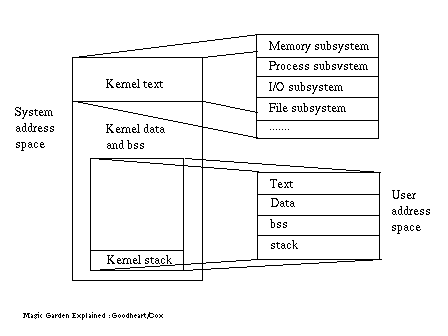

# [进程简介](http://www.tldp.org/LDP/LG/issue23/flower/intro.html)

当程序开发者编写、编译、链接一个程序时，这个程序是以文件的形式存储在磁盘上。程序文件文件拥有特定的格式，使得操作系统以及shell能够识别出来这个文件是一个可执行程序。

当一个运行一个程序时，会在内存中实例化，此时会申请系统资源，例如数据结构需要的内存、文件描述符，除此之外还包括至少一个执行线程，它定义了进程当前的状态以及随后进程需要执行的操作。当前执行的程序，或者说进程，当它处于运行状态时会完全占据处理器。除此之外，进程还会使用文件系统中的文件并且直接或者间接的访问物理设备。

一个进程可能运行在两种模式下：用户态和内核态。一个进程会在这两种状态之间转换，换言之用户态和内核态是同一个进程的不同运行阶段。进程默认是用户态的，例如很多应用进程，它们分别执行在隔离的环境中，操作系统保证同一台机器上的进程不会相互影响。当用户态进程调用系统调用时切换成内核态，产生一个异常或者此时有中断产生（时钟），这时内核代替进程执行。At any one time during its execution a process runs in the context of itself and the kernel runs in the context of the currently running process. 

执行在内核态的进程拥有访问所有计算机资源（例如所有物理内存）的特殊权限，而用户态的进程则有很多限制。The distinction between a process in either user or kernel mode may be supported by the hardware which serves to enforce the privilege rule and so protect the computer system from undue damage or failure due to ill behaved user processes.

尽管基本概念是类似的，但是不同的操作系统实现进程管理的方式不同。

### Linux

特殊权限的操作在Linux中都是通过一个集成式内核实现，内核提供了操作硬件所需的核心服务。

Linux内核也支持模块加载机制作为核心服务的补充，例如增加一个新的文件系统。因为内核以一个单独实体的方式承担了很多职责，这种内核架构叫做宏内核（[macrokernel](http://blog.csdn.net/linuxzhouying/article/details/7065666)）。

### Windows NT

Windows NT是基于层次化操作系统（例如VAX、VMS）的衍生，Windows NT是一个真正的客户端/服务器微内核操作系统（例如Mach）架构（The Windows NT operating system is based on a derivative of a layered operating system (such as VAX VMS) and a true client/server operating (such as Mach) microkernel architecture），核心系统以最高效的方式执行最基本的任务。

除了微内核以外其他特权进程的总体叫做执行者（Executive），这些进程分别管理一个单独的子系统，为进程的创建和资源分配所需的个性化服务，具体包括：进程管理、对象管理、虚拟内存管理、

操作系统本身大部分是在内核态运行的。用户态进程经常需要访问一些服务，这些服务只能在内核态的拥有特殊权限的代码实现。此时用户态进程调用一个系统函数触发一个硬件“陷阱”，从而进行上下文切换，切换到系统模式以后（译者注：系统模式和是不是就是内核态）用户态进程所需要的操作就能够通过操作系统信任的函数在可控的状态下执行，操作执行完成以后切换回用户态。

每个用户进程在自己的地址空间运行（32位系统是大约3GB），进程之间的地址空间是隔离的。从每个进程自己的视角来看，它认为自己完全的占据它所运行机器，换句话说它运行在自己的“虚拟机”上，“虚拟机”由操作系统控制，并且和其他进程隔离。
