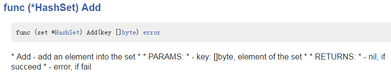
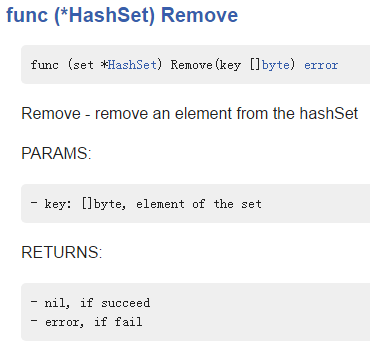
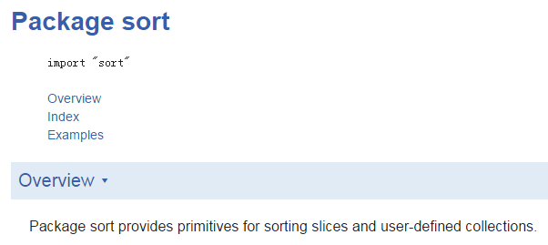
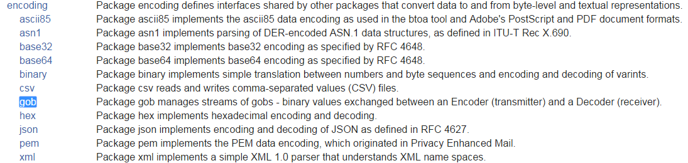
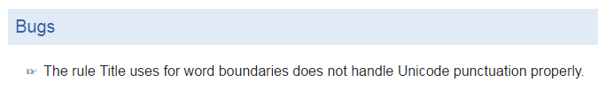
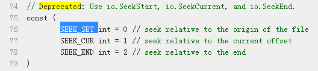
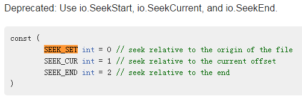
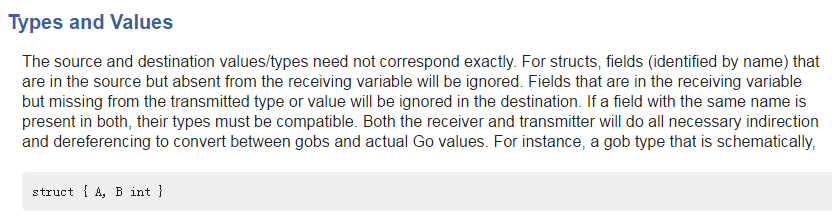
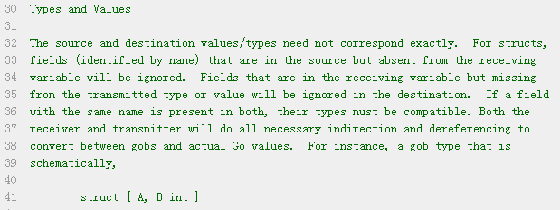

## [Godoc: documenting Go code.md](https://blog.golang.org/godoc-documenting-go-code)

31 March 2011 By Andrew Gerrand

### TLDR
`godoc -http=:8080`可以启动一个web server，godoc会对GOPATH、GOROOT中的所有包生成注释，通过浏览器可以访问注释的HTML页面。除此之外、[The Go Blog](http://blog.golang.org/) 、[Effective Go](https://golang.org/doc/effective_go.html)这些内容都能从godoc创建的web server看到。

### 概述
Go语言的项目对于文档很重视，文档是保证软件可用性和可维护性的一个重要的部分。当然，文档应给写的好并且含义清晰，同时还应该易于书写和维护。最理想的文档是和代码代码写在一起，这样二者可以一起进化。程序员越容易写出好的文档，对于使用代码的所有人越有利。

译者注：我本人比较赞同代码和文档写在一起，这样不用改完代码以后再改一次README.md。当然即使是这样，通常是代码改了，文档也懒得改。

### godoc
为了达到上面的目的，我们开发了文档工具[godoc](http://golang.org/cmd/godoc/)，这篇文章描述了这个工具是如何生成文档的，你可以遵循我们的规范，使用godoc工具为你的项目写出高质量的文档。

godoc通过对go源码（包括注释）分析，生成HTML或者纯文本格式的文档。这样就使得文档和代码能够维护在一起。例如：通过godoc的网页版接口可以实现从[函数文档](http://golang.org/pkg/strings/#HasPrefix)到[函数实现](http://golang.org/src/pkg/strings/strings.go?#L312)的跳转。

godoc从概念上和Python的[docstring](http://www.python.org/dev/peps/pep-0257/)以及Java的[Javadoc](http://www.oracle.com/technetwork/java/javase/documentation/index-jsp-135444.html)很相像，但是godoc的设计更简单。godoc直接读取的注释不需要想docstring那样是python语言的一部分，也不需要像Javadoc那样遵循某种机器可读的语法。godoc的注释仅仅是普通的注释，即使godoc不存在，你也可以阅读。

>The comments read by godoc are not language constructs (as with Docstring) nor must they have their own machine-readable syntax (as with Javadoc).

### 一般注释
godoc的注释方法很简单：在需要注释的类型、变量、常量、函数、包的声明前按照普通的注释写法来写就行，注释和声明之间不能加空格。godoc会把这些注释作为被注释内容的文档。例如：fmt包的[Fprintf函数](http://golang.org/pkg/fmt/#Fprint)，它的注释和文档如下；
```golang
// Fprint formats using the default formats for its operands and writes to w.
// Spaces are added between operands when neither is a string.
// It returns the number of bytes written and any write error encountered.
func Fprint(w io.Writer, a ...interface{}) (n int, err error) {
```


注意：Fprintf的注释内容是以被注释内容的名字开头的一个完整句子，这样godoc可以生成不用格式的文档，包括：纯文本、HTML、UNIX man，当工具从多行注释内容中截取一行时也能很好的阅读。

>Notice this comment is a complete sentence that begins with the name of the element it describes. This important convention allows us to generate documentation in a variety of formats, from plain text to HTML to UNIX man pages, and makes it read better when tools truncate it for brevity, such as when they extract the first line or sentence.

译者注：多行注释的中间行以`*`开头会导致godoc不能生成正常的文档。
```golang
/*
* Add - add an element into the set
*
* PARAMS:
*   - key: []byte, element of the set
*
* RETURNS:
*   - nil, if succeed
*   - error, if fail
*/
func (set *HashSet) Add(key []byte) error {

/*
  Remove - remove an element from the hashSet
 
  PARAMS:
    - key: []byte, element of the set
 
  RETURNS:
    - nil, if succeed
    - error, if fail
*/
func (set *HashSet) Remove(key []byte) error {


```



### 注释包
包声明前的注释可以用于生成常规包文档（包文档的Overview部分）。这些注释通常很简短，例如[sort包]：
```golang
// Package sort provides primitives for sorting slices and user-defined
// collections.
package sort
```



包的注释也可以很详细，例如[gob包](http://golang.org/pkg/encoding/gob/)使用了另一种注释包的方法。如果包的文档需要大量的介绍内容，那么就把对应的注释单独放在一个[doc.go](http://golang.org/src/pkg/encoding/gob/doc.go)文件中，这个文件只包含注释和包的声明。

不论包的注释有多长、是否单独放在一个文件中，注释的第一句话会出现在[包列表](http://golang.org/pkg/)中。



### bug注释
不紧挨着顶层声明语句（译者注：顶层指的是没有缩进的）的注释会被godoc忽略，其中有一个例外是"BUG(who)"，这个注释会被godoc识别为已知的bug，并在包文档的Bugs部分体现出来。"who"表示能够对这个bug提供更多细节的然，例如：[bytes包]里面已知的问题：
```golang
// BUG(r): The rule Title uses for word boundaries does not handle Unicode punctuation properly.
```



### 废弃注释
有时，如果结构体的字段、函数、类型，甚至是整个包已经被替代了，但是为了兼容已有的程序还不能删除。为了在文档中表现某个标识符不应该被使用了，可以通过"Deprecated:"来实现，后面写具体废弃的信息。[标准库中的例子](https://golang.org/search?q=deprecated)




### 格式化
godoc格式化为HTML有一些规则：

1. 没有空行的注释认为是一个连续的段落，段落之间可以通过空行分开
1. 对于代码可以用tab相对顶层注释缩进，格式化为HTML以后加上<pre\>标签（参考doc.go）
1. url会被自动转换成HTML链接，不需要用户做任何的标记

注意：上面这些规则不需要你做任何额外的事情。

译者注：下图中灰色的部分就是加上<pre\>标签以后的效果


对应的注释如下：41行开头是一个tab，在网页上显示成8个空格。


### 总结
事实上，godoc提供的功能很简单，这是这个工具最好的一点。所以，很多的Go代码包括标准库都遵循godoc的格式写注释。

如果想给你自己的代码生成高质量的文档，只需要在被注释的内容前一行写注释就可以。通过godoc的命令行和HTTP接口默认可以访问`$GOROOT/src/pkg`和`GOPATH`中的所有包，其他位置的包可以通过`-path`选项指定，或者是在包源码的路径执行`godoc .`。更多内容参考[godoc文档](http://golang.org/cmd/godoc/)。

