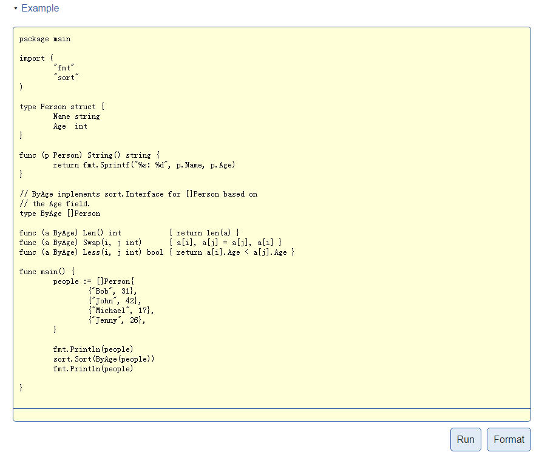

## [Testable Examples in Go](https://blog.golang.org/examples)

7 May 2015 By Andrew Gerrand

### 简介
godoc中的[Examples](https://golang.org/pkg/testing/#hdr-Examples)是一个Go代码片段，它既可以作为包文档的一部分，同时也能作为单测运行和验证。除以之外，用户通过godoc的网页阅读包文档时，还可以通过点击Run按钮直接运行代码片段。

通过对包文档提供可执行的功能，当接口改变时文档的信息就不会过时。（译者注：可执行我觉得有两个含义：通过网页可以执行例子函数，例子函数本身也会作为单测执行。）
>Having executable documentation for a package guarantees that the information will not go out of date as the API changes.

标准库包含很多这样的例子，例如：[strings包](http://golang.org/pkg/strings/#Contains)

这篇博客解释如何为你的包编写例子函数。

### 例子函数也是单测
例子函数编译时作为包的单测一部分，编译后的例子函数是否执行是可选的。

和通常的单测一样，例子函数也是放在包下面的_test.go文件中。和通常的单测不同的是例子函数的函数不接受任何输入参数，函数名以`Example`开头（通常的单测函数是`Test`开头）。

[stringutil](https://godoc.org/github.com/golang/example/stringutil/)是[Go语言代码库的例子部分](https://github.com/golang/example)的一部分，下面展示了`stringutil.Reverse`函数的使用：
```golang
package stringutil_test

import (
    "fmt"

    "github.com/golang/example/stringutil"
)

func ExampleReverse() {
    fmt.Println(stringutil.Reverse("hello"))
    // Output: olleh
}
```

这个函数可以写在`stringsutil`目录下的`example_test.go`文件中。godoc会把这个函数显示在文档后面。


运行这个包的单测时，我们可以看到自动被执行了，我们什么也不需要做。
```
$ go test -v
=== RUN TestReverse
--- PASS: TestReverse (0.00s)
=== RUN: ExampleReverse
--- PASS: ExampleReverse (0.00s)
PASS
ok      github.com/golang/example/stringutil    0.009s
```

### 输出注释
如何定义`ExampleReverse`函数单测通过？当执行这个函数时，测试框架捕获这个函数向标准输出打印的数据，然后和`Output:`注释的内容比较，如果函数的输出和注释的内容一致那么单测就通过了。

为了观察单测失败的例子函数，我们把输出注释的内容修改为一个明显不正确的结果，然后再运行测试：
```golang
func ExampleReverse() {
    fmt.Println(stringutil.Reverse("hello"))
    // Output: golly
}

$ go test
--- FAIL: ExampleReverse (0.00s)
got:
olleh
want:
golly
FAIL
```

**如果我们把输出注释去掉，例子函数被编译但是不会执行：**
```golang
func ExampleReverse() {
    fmt.Println(stringutil.Reverse("hello"))
}

$ go test -v
=== RUN TestReverse
--- PASS: TestReverse (0.00s)
PASS
ok      github.com/golang/example/stringutil    0.009s
```

没有输出注释的例子函数通常用于演示接口的使用方法，这些例子函数不会作为单测执行。比如：例子函数需要访问网络，此时可能无法知道输出结果是什么，但是至少要保证例子函数可以编译通过。

### 例子函数名
godoc对于例子函数命名的约定是：Example前缀+包顶层标识符。遵循这个约定，godoc会把`ExampleReverse`例子函数放在`Reverse`函数的文档后面。
```golang
func ExampleFoo()     // documents the Foo function or type
func ExampleBar_Qux() // documents the Qux method of type Bar
func Example()        // documents the package as a whole
```

如果有多个例子函数，那么godoc命名的约定是：Example前缀+包顶层标识符+下划线+小写字母。下面是`Reverse`的三个例子函数：
```golang
func ExampleReverse()
func ExampleReverse_second()
func ExampleReverse_third()
```

### 更大的例子函数
有时为了编写一个好的例子，可能需要的不仅仅是一个函数。

例如：为了演示[sort包](https://golang.org/pkg/sort/)，我们会展示`sort.Interface`的实现。因为Go语言不能在函数体内部声明方法，因此这个例子函数除了一个函数以外还需要包含一些的上下文。

为了实现这一点，我们可以实现“单文件的例子函数”：

1. 文件名以`_test.go`结尾
2. 文件中只能包含一个例子函数，不能有单测和性能测试函数
3. 至少需要一个包顶层的声明

当在godoc的网页上显示“单文件例子函数”时，会把整个文件显示出来。



一个包可以包含很多单文件例子函数，每个文件包含一个例子函数，参考[sort包源码](https://golang.org/src/sort/)了解更多的实际应用。

下面是sort包一个完整的单文件例子函数：
```golang
package sort_test

import (
    "fmt"
    "sort"
)

type Person struct {
    Name string
    Age  int
}

func (p Person) String() string {
    return fmt.Sprintf("%s: %d", p.Name, p.Age)
}

// ByAge implements sort.Interface for []Person based on
// the Age field.
type ByAge []Person

func (a ByAge) Len() int           { return len(a) }
func (a ByAge) Swap(i, j int)      { a[i], a[j] = a[j], a[i] }
func (a ByAge) Less(i, j int) bool { return a[i].Age < a[j].Age }

func Example() {
    people := []Person{
        {"Bob", 31},
        {"John", 42},
        {"Michael", 17},
        {"Jenny", 26},
    }

    fmt.Println(people)
    sort.Sort(ByAge(people))
    fmt.Println(people)

    // Output:
    // [Bob: 31 John: 42 Michael: 17 Jenny: 26]
    // [Michael: 17 Jenny: 26 Bob: 31 John: 42]
}
```

### 总结
godoc的例子函数是“把编写和维护代码作为文档”一种很好的方法，用户可以编辑、编译、运行例子函数。开始使用它吧！