## [Visualizing Concurrency in Go](https://divan.github.io/posts/go_concurrency_visualize/)

### TLDR
1. 通过WebGL把goroutine可视化，工具[github.com/divan/gotrace](https://github.com/divan/gotrace)

>This approach, though, is super limited. I have to accurately choose examples, rename channels and goroutines to make more or less complex code to produce a correct trace. With this approach, there is no easy way to correllate channels between goroutines if they have different names. Not to mention channels sent over channels of type chan. There are also huge issues with timing - output to stdout can take more time than sending value, so in some cases I had to place time.Sleep(some amount of milliseconds) to get proper animation.
>Basically, that is a reason why I’m not open-sourcing the code yet. I’m playing with Dmitry Vyukov’s execution tracer, it seems to provide good level of details of events, but do not contain info on which values are being sent. Maybe there are better ways to achieve the desired goal. Write me in twiter or in comments here, if you have ideas. It would be super great to extend this two-weekends tool to be a real debugging/tracing instrument suitable for any Go program.

2. Go runtime holds waiting FIFO queue for receivers (goroutines ready to receive on the particular channel)：https://github.com/golang/go/blob/master/src/runtime/chan.go#L34

### 参考
[可视化学习Go并发编程](https://mp.weixin.qq.com/s/732C7Xaje_BAW5WvTZ9qPA)

### 翻译
如果你不喜欢博客，喜欢看视频，下面是我在GopherCon 2016上的[演讲](https://www.youtube.com/watch?v=KyuFeiG3Y60)

Go语言一个很强大的功能是原生的并发，它的理论基础是[Tony Hoare’s CSP](https://en.wikipedia.org/wiki/Communicating_sequential_processes)。Go在设计时就考虑了要很好的支持并发，因此我们能构建复杂的并发流水线。但是你可能想知道：不同的并发模式的可视化是什么样？

当然，你肯定想象过这个问题。我们都通过不同的画面来思考问题。如果我问你这个问题“从1到100的数字”，你脑子里面会有自己的画面，甚至是下意识的就能出现。例如，我的画面是1-20构成一条直线，然后向右转90度，一直到1000。我回想起我小时候上幼儿园，在衣帽间的墙上写满了数字，然后20恰好是在墙角。当然你也可以有自己的画面。另一个例子是对一年四季的可视化，一些人可能想象成一个盒子，另一些人会想象成一个圈。

不论如何，我想给你展示的是我用WebGL绘制出的Go的场景并发模式，我的这个尝试或多或少代表了我脑子里如何看待并发程序。当然我也很乐于看到你脑子中不同的画面。我特别想知道Rob Pike或者Sameer Ajmani是怎么想象并发的。我打赌他们的画面一定非常有趣。

所以，让我们开始一个最基础的“hello，concurrent world”例子，让我们先熟悉一下我对Go并发可视化的尝试中的一些概念。

#### Hello, Concurrent world
代码非常简单：单channel、单goroutine、一个写一个读。
```go
package main

func main() {
    // create new channel of type int
    ch := make(chan int)

    // start new anonymous goroutine
    go func() {
        // send 42 to channel
        ch <- 42
    }()
    // read from channel
    <-ch
}
```

[Go to interactive WebGL animation](https://divan.github.io/demos/hello/)

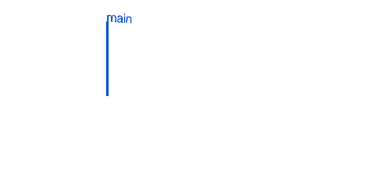

蓝色线表示goroutine随时间执行，细蓝色线连接了main和#go 19，表示goroutine的开始和结束，展示了（goroutine的）父子关系，最后，红色的箭头表示发送和接收。尽管channel的读和写是两个独立的事件，但是我尝试把它表示成一个动画“从A到B”。#19表示goroutine的运行时id，通过Scott Mansfield的文章[“Goroutine IDs”](http://blog.sgmansfield.com/2015/12/goroutine-ids/)中建议的trick方法获取。

#### 定时器
事实上，你可以构建一个简单的定时器例子——创建一个channel，启动一个goroutine等待一个给定的间隔后写这个channel，把这个channel返回给函数的调用者。调用者读取channel时会阻塞给定的时间。让我们执行timer函数24次，然后尝试可视化它。（动画）很整齐失败，那么我们继续其他的例子。
```go
package main

import "time"

func timer(d time.Duration) <-chan int {
    c := make(chan int)
    go func() {
        time.Sleep(d)
        c <- 1
    }()
    return c
}

func main() {
    for i := 0; i < 24; i++ {
        c := timer(1 * time.Second)
        <-c
    }
}
```

[Go to interactive WebGL animation](https://divan.github.io/demos/timers/)


#### 乒乓
这个美妙的并发例子是在Google工程师Sameer Ajmani的一个伟大的演讲中发现的，
[“Advanced Go Concurrency Patterns”](https://talks.golang.org/2013/advconc.slide#1)。当然这个模式并不是很先进，但是对于那些只想让自己熟悉Go的并发的人来说是很新鲜、有趣的。

我们创建一个channel作为兵乓游戏的球桌，乒乓球是一个整型的变量，两个goroutine作为运动员，通过对值递增的方式“击打”乒乓球。
```go
package main

import "time"

func main() {
    var Ball int
    table := make(chan int)
    go player(table)
    go player(table)

    table <- Ball
    time.Sleep(1 * time.Second)
    <-table
}

func player(table chan int) {
    for {
        ball := <-table
        ball++
        time.Sleep(100 * time.Millisecond)
        table <- ball
    }
}
```

[Go to interactive WebGL animation](https://divan.github.io/demos/pingpong/)

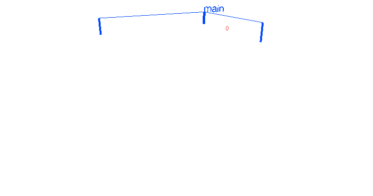

这里我建议你打开[上面的链接](https://divan.github.io/demos/pingpong/)，进入交互式WebGL动画（Ctrl/Cmd+鼠标左键在新tab中打开链接），并自己玩儿一下交互模式。你可以减慢、加快动画速度，从不同的角度看动画。

现在，让我们把两个球员增加到三个球员。
```go
    go player(table)
    go player(table)
    go player(table)
```

[Go to interactive WebGL animation](https://divan.github.io/demos/pingpong3/)

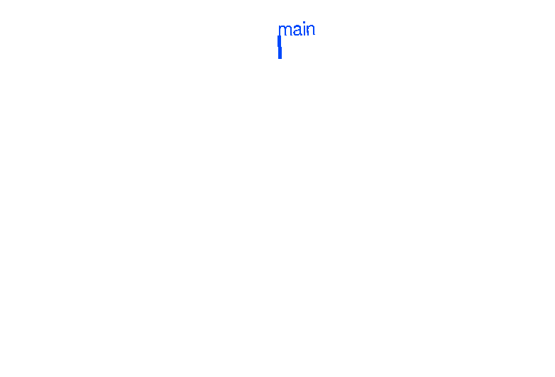

我们能看到每个球员轮流击打，你可能奇怪为啥是这样的顺序。为什么我们看到goroutine接收（channel中的数据）符合严格的顺序。

答案是Go的运行时会对接收者（准备好接收特定的channel的goroutine）维护一个FIFO的等待队列，[FIFO queue for receivers](https://github.com/golang/go/blob/master/src/runtime/chan.go#L34)，在我们的例子中每个球员都是在把球打向球台后就等待接收。让我们看一个更复杂的例子，执行100个乒乓球运动员。
```go
for i := 0; i < 100; i++ {
    go player(table)
}
```

[Go to interactive WebGL animation](https://divan.github.io/demos/pingpong100/)

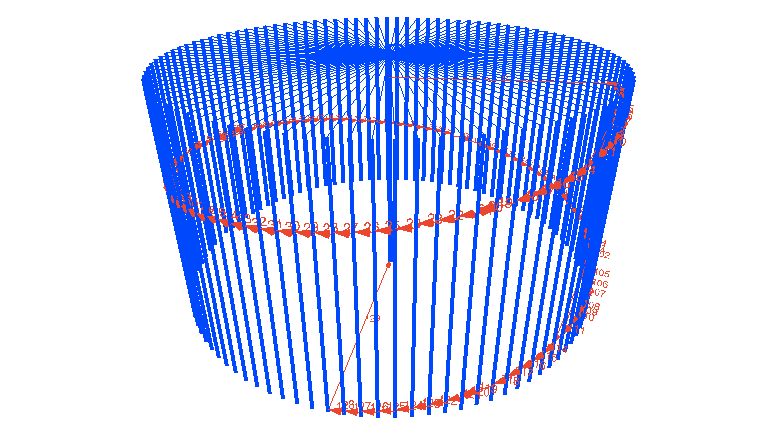

现在FIFO很清晰了，我们还可以创建1百万个goroutine（goroutine很廉价），但是对于我们的目标（译者注：阐述FIFO），1百万个goroutine就太多了。让我们看一些其他好玩的东西，例如通常的消息模式。

#### 扇入
并发世界中自常见的模式就是扇入，它和扇出相反，后面我们会介绍。简而言之，扇入就是一个函数从多个输入中读取，并把多路输入复用到一个channel中。
例子：
```go
package main

import (
    "fmt"
    "time"
)

func producer(ch chan int, d time.Duration) {
    var i int
    for {
        ch <- i
        i++
        time.Sleep(d)
    }
}

func reader(out chan int) {
    for x := range out {
        fmt.Println(x)
    }
}

func main() {
    ch := make(chan int)
    out := make(chan int)
    go producer(ch, 100*time.Millisecond)
    go producer(ch, 250*time.Millisecond)
    go reader(out)
    for i := range ch {
        out <- i
    }
}
```

[Go to interactive WebGL animation](https://divan.github.io/demos/fanin/)


如我们所见，第一个生产者每100毫秒产生一个值，第二个是每250毫秒。但是接收者是立即从两个生产者中接收。在我们的例子中，多路复用是在main函数中实现的（译者注：ch->out，还有一种扇入，reader通过select读取多个channel）。

#### 工作者
和扇入相反的是扇出，也可以叫做工作者模式。多个goroutine从一个channel中读取，把一定数量的工作分布到多个CPU核上执行，因此叫做工作者模式。Go很容易实现这个模式，只需要启动若干个goroutine，传入一个channel，然后向这个channel中写入数据。分发和多路复用都是通过Go的运行时自动完成的，
```go
package main

import (
    "fmt"
    "sync"
    "time"
)

func worker(tasksCh <-chan int, wg *sync.WaitGroup) {
    defer wg.Done()
    for {
        task, ok := <-tasksCh
        if !ok {
            return
        }
        d := time.Duration(task) * time.Millisecond
        time.Sleep(d)
        fmt.Println("processing task", task)
    }
}

func pool(wg *sync.WaitGroup, workers, tasks int) {
    tasksCh := make(chan int)

    for i := 0; i < workers; i++ {
        go worker(tasksCh, wg)
    }

    for i := 0; i < tasks; i++ {
        tasksCh <- i
    }

    close(tasksCh)
}

func main() {
    var wg sync.WaitGroup
    wg.Add(36)
    go pool(&wg, 36, 50)
    wg.Wait()
}
```

[Go to interactive WebGL animation](https://divan.github.io/demos/workers/)

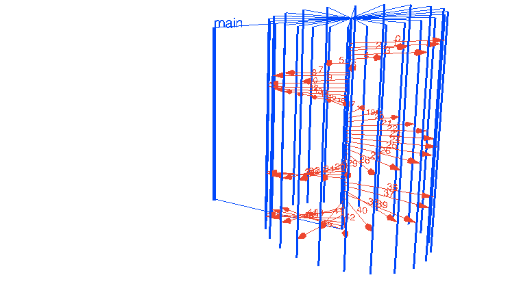

值得指出的一件事：并行（parallelism）。如你所见，所有的goroutine都是并行执行的，等待channel中有任务就执行。通过上面的动画，可以很容易发现goroutine是逐一接收到任务的。不幸的是，这个动画没有通过颜色区分goroutine是什么时候接收到任务以及等待任务。但是这个例子设置了GOMAXPROCS=4，所以只能有4个goroutine并行，后面我们或简单的介绍一下这个话题。

现在让我们做一些更复杂的例子，启动的worker可以创建子worker。
```go
package main

import (
    "fmt"
    "sync"
    "time"
)

const (
    WORKERS    = 5
    SUBWORKERS = 3
    TASKS      = 20
    SUBTASKS   = 10
)

func subworker(subtasks chan int) {
    for {
        task, ok := <-subtasks
        if !ok {
            return
        }
        time.Sleep(time.Duration(task) * time.Millisecond)
        fmt.Println(task)
    }
}

func worker(tasks <-chan int, wg *sync.WaitGroup) {
    defer wg.Done()
    for {
        task, ok := <-tasks
        if !ok {
            return
        }

        subtasks := make(chan int)
        for i := 0; i < SUBWORKERS; i++ {
            go subworker(subtasks)
        }
        for i := 0; i < SUBTASKS; i++ {
            task1 := task * i
            subtasks <- task1
        }
        close(subtasks)
    }
}

func main() {
    var wg sync.WaitGroup
    wg.Add(WORKERS)
    tasks := make(chan int)

    for i := 0; i < WORKERS; i++ {
        go worker(tasks, &wg)
    }

    for i := 0; i < TASKS; i++ {
        tasks <- i
    }

    close(tasks)
    wg.Wait()
}
```

[Go to interactive WebGL animation](https://divan.github.io/demos/workers2/)


很好，当然我们可以把worker和子worker的数量设置的很高，但是我尝试把动画展示的更清晰、更容易理解。

还有其他更酷的扇出模式，例如动态数量的worker和子worker、通过channel发送（任务执行）结果，（这些模式我们就不一一展示了）目前扇出的概念应该足够清楚了。

#### 服务器
下一个例子和扇出模型很像，但是goroutine只存在一个很短的时间，只满足一些任务。最典型的实现是tcp服务器：创建一个监听，循环执行accept，对每个连接创建一个goroutine。这个模型很容易表达，实现服务端的handler也很容易。看下面这个简单的例子：
```go
package main

import "net"

func handler(c net.Conn) {
    c.Write([]byte("ok"))
    c.Close()
}

func main() {
    l, err := net.Listen("tcp", ":5000")
    if err != nil {
        panic(err)
    }
    for {
        c, err := l.Accept()
        if err != nil {
            continue
        }
        go handler(c)
    }
}
```

[Go to interactive WebGL animation](https://divan.github.io/demos/servers/)


这个例子很没意思，看起来没有并发。当然，程序底层是很复杂的，只不过我们看不到而已。[“Simplicity is complicated”](https://www.youtube.com/watch?v=rFejpH_tAHM)

但是我们回到并发这个话题，我们给服务器添加一些活动，例如每个handler想异步的写日志。在我们的例子中，Logger本身是一个独立的goroutine完成写日志的工作。
```go
package main

import (
    "fmt"
    "net"
    "time"
)

func handler(c net.Conn, ch chan string) {
    ch <- c.RemoteAddr().String()
    c.Write([]byte("ok"))
    c.Close()
}

func logger(ch chan string) {
    for {
        fmt.Println(<-ch)
    }
}

func server(l net.Listener, ch chan string) {
    for {
        c, err := l.Accept()
        if err != nil {
            continue
        }
        go handler(c, ch)
    }
}

func main() {
    l, err := net.Listen("tcp", ":5000")
    if err != nil {
        panic(err)
    }
    ch := make(chan string)
    go logger(ch)
    go server(l, ch)
    time.Sleep(10 * time.Second)
}
```

[Go to interactive WebGL animation](https://divan.github.io/demos/servers2/)

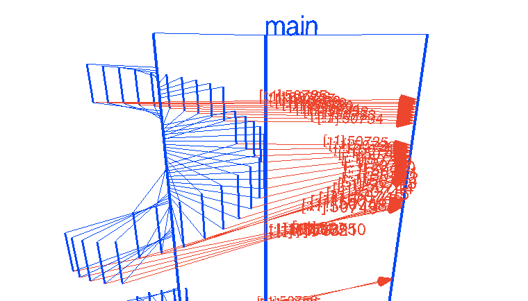

看起来很有展示性了吧？但是很容易看出来我们的logger goroutine会很快成为瓶颈，如果请求数量增加并且写日志需要消耗一些时间（例如准备和编码数据）。我们可以把服务器模式和扇出模式相结合（解决logger瓶颈的问题），让我们开始吧！

#### 服务器+工作者
服务器+工作者例子是logger例子的高级版。这个例子中不仅执行了任务，还把结果通过results channel发送回工作者池。尽管没有什么大不了的，但是这个例子把单个goroutine的logger扩展，具有实际意义。

让我们看代码和动画：
```go
package main

import (
    "net"
    "time"
)

func handler(c net.Conn, ch chan string) {
    addr := c.RemoteAddr().String()
    ch <- addr
    time.Sleep(100 * time.Millisecond)
    c.Write([]byte("ok"))
    c.Close()
}

func logger(wch chan int, results chan int) {
    for {
        data := <-wch
        data++
        results <- data
    }
}

func parse(results chan int) {
    for {
        <-results
    }
}

func pool(ch chan string, n int) {
    wch := make(chan int)
    results := make(chan int)
    for i := 0; i < n; i++ {
        go logger(wch, results)
    }
    go parse(results)
    for {
        addr := <-ch
        l := len(addr)
        wch <- l
    }
}

func server(l net.Listener, ch chan string) {
    for {
        c, err := l.Accept()
        if err != nil {
            continue
        }
        go handler(c, ch)
    }
}

func main() {
    l, err := net.Listen("tcp", ":5000")
    if err != nil {
        panic(err)
    }
    ch := make(chan string)
    go pool(ch, 4)
    go server(l, ch)
    time.Sleep(10 * time.Second)
}
```

[Go to interactive WebGL animation](https://divan.github.io/demos/servers3/)


我们把任务分布到4个goroutine上，有效的提高了logger的吞吐，但是从这个动画中我们同样可以发现logger仍然是问题的源头。成百上千个连接的数据汇聚到一个channel中同样会导致类似一个logger的瓶颈。但是，当然这只会在很高的负载下才会发生。

#### 并发筛选素数
扇入扇出的例子够多了，我们来看一些更复杂的并发算法。我最喜欢的例子之一就是并发筛选素数，这个例子是在[“Go Concurrency Patterns”](https://talks.golang.org/2012/concurrency.slide)演讲里面发现的。素数筛选也叫做[Sieve of Eratosthenes](https://en.wikipedia.org/wiki/Sieve_of_Eratosthenes)，是一个古老的算法，它能够查找给定上限范围内的素数。它的原理是把所有素数的倍数顺序的剔除。常规算法不够有效，特别是在多核机器上。

这个算法的并发变种使用goroutine过滤数字：每发现一个素数就通过一个goroutine过滤，通过channel把素数发给过滤goroutine。当发现素数时，会通过另一个channel发送回main用于输出。当然，这个算法也不是十分有效，特别是当你想要找到很大的素数并且最低的Big O复杂度，但是我认为这个算法很优雅。
```go
// A concurrent prime sieve
package main

import "fmt"

// Send the sequence 2, 3, 4, ... to channel 'ch'.
func Generate(ch chan<- int) {
    for i := 2; ; i++ {
        ch <- i // Send 'i' to channel 'ch'.
    }
}

// Copy the values from channel 'in' to channel 'out',
// removing those divisible by 'prime'.
func Filter(in <-chan int, out chan<- int, prime int) {
    for {
        i := <-in // Receive value from 'in'.
        if i%prime != 0 {
            out <- i // Send 'i' to 'out'.
        }
    }
}

// The prime sieve: Daisy-chain Filter processes.
func main() {
    ch := make(chan int) // Create a new channel.
    go Generate(ch)      // Launch Generate goroutine.
    for i := 0; i < 10; i++ {
        prime := <-ch
        fmt.Println(prime)
        ch1 := make(chan int)
        go Filter(ch, ch1, prime)
        ch = ch1
    }
}
```

[Go to interactive WebGL animation](https://divan.github.io/demos/primesieve/)


请自由的在交互模式中玩一下。我很喜欢这张图的解释性：它能帮我们更好的理解这个算法。generator goroutine从2开始发送每个整数，每个新的goroutine依次过滤掉特定一个素数的倍数，并把第一个素数返回给main。如果你旋转这个动画从上面看，你会发现所有从filter goroutine发给main的数字都是素数。美丽的算法，特别是用3D动画来看。

#### GOMAXPROCS
现在让我们回到工作者那个例子。记得我说那个例子是通过GOMAXPROCS=4来执行的？那是因为所有这些动画都不是艺术模拟的，而是真实程序的trace结果。

让我们更新一下我们的记忆，看一下[GOMAXPROCS](https://golang.org/pkg/runtime/#GOMAXPROCS)是什么：
>GOMAXPROCS设置了同一时间最多能使用的CPU数量。

当然，CPU指的是逻辑CPU，我修改一下工作者的例子，让工作者实际做一些操作（而不是仅仅sleep），并且会消耗真实的CPU时间。然后我运行这个代码，除了修改GOMAXPROCS以外没有其他的修改。我的Linux机器有2个CPU，每个12核，总共24核。

所以，首先我们展示的是把程序运行在1个CPU上，然后第二个是把程序运行在24个CPU上。

[WebGL animation - 1](https://divan.github.io/demos/gomaxprocs1/)

[WebGL animation - 24](https://divan.github.io/demos/gomaxprocs24/)

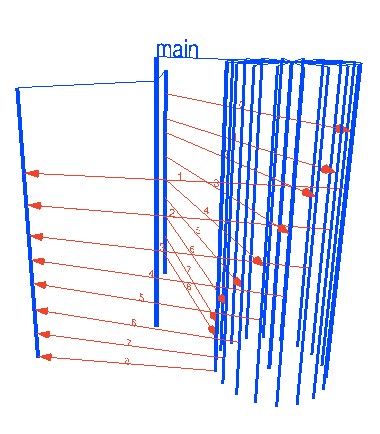

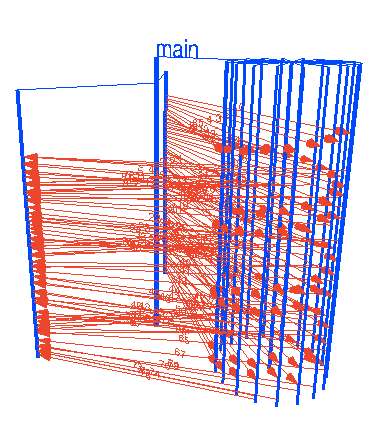

这两个动画时间速度是不一样的（我想让所有的动画图片能够有相同的总时间或者说图片的高度是相同的），所以差别很明显。GOMAXPROCS=1时下一个worker只能等上一个worker完成任务以后才能开始。GOMAXPROCS=24则有了巨大的加速，多路复用的开销则是微不足道的，或者你只是简单的忘记了添加结束条件，然后死循环了。

然而，增加GOMAXPROCS并不能总是提高性能，理解这一点很重要，甚至会有一些场景，增加GOMAXPROCS起到反作用。

#### goroutine泄漏
我们还能展示Go的并发里面的其他什么？我想到的是goroutine泄漏。例如：如果[start goroutine but it falls out of scope](http://openmymind.net/Leaking-Goroutines/)就会导致泄漏。

我第一次在我的代码中遇到goroutine泄漏，我的脑子里面立即出现了很恐怖的动画，紧接着我写了[expvarmon](https://github.com/divan/expvarmon)这个工具。现在我能把脑子里恐怖的动画展现出来了。

看看：我只是看到这个图片就感觉疼痛了。图中所有的蓝色线都是资源的浪费，并且也是你的程序的定时炸弹。

[Go to interactive WebGL animation](https://divan.github.io/demos/leak/)

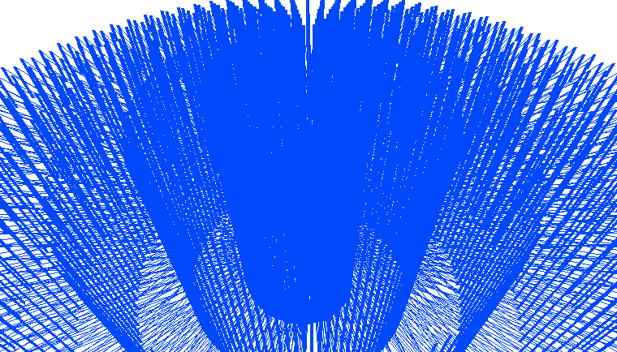

#### 并行不是并发
最后一件事我想要说明的是并发和并行之间的区别。这个话题在[这里](https://existentialtype.wordpress.com/2011/03/17/parallelism-is-not-concurrency/)和
[这里](https://ghcmutterings.wordpress.com/2009/10/06/parallelism-concurrency/)都很好的介绍了。另外Rob Pike的这个伟大的[演讲](https://www.youtube.com/watch?v=cN_DpYBzKso)也是关于这一话题的，它是必看的视频之一，真的。

简而言之，
>并行是简单的把事情并行执行。并发是构建你的程序一种方法。

另外，并发程序可能是并行的，也可能不是。并发和并行的概念是正交的，我们在前面设置GOMAXPROCS的例子中就看到了这一点。

我可以用文字在重复介绍上面所有的文章和演讲中的例子，但是一图胜千言。这里我能做的就是把差异可视化出来，所以，下面这些图这是并发，很多事情在同一时间一起执行：

[Go to interactive WebGL animation](https://divan.github.io/demos/parallelism1/)

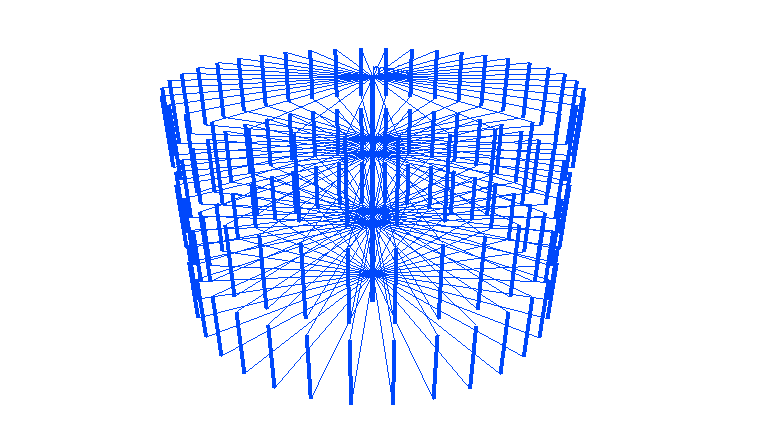

下面也是并行：

[Go to interactive WebGL animation](https://divan.github.io/demos/parallelism2/)

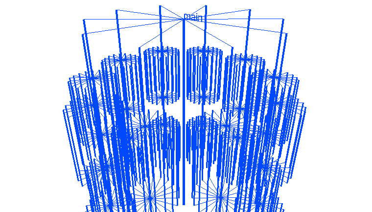

但是这些是并发：


这也是并发：


#### 动画怎么做
创建这些动画，我写了两个程序：gotracer和gothree.js，后者是个库。首先gotracer做下面这些事情：

1. 解析Go代码的AST树，在并发相关的事件插入特殊的命令，例如：goroutine的启动和停止、创建channel、从channel发送和接收。
2. 执行修改后的程序
3. 分析输出产生一个json文件，描述时间和时间戳。

json的例子：
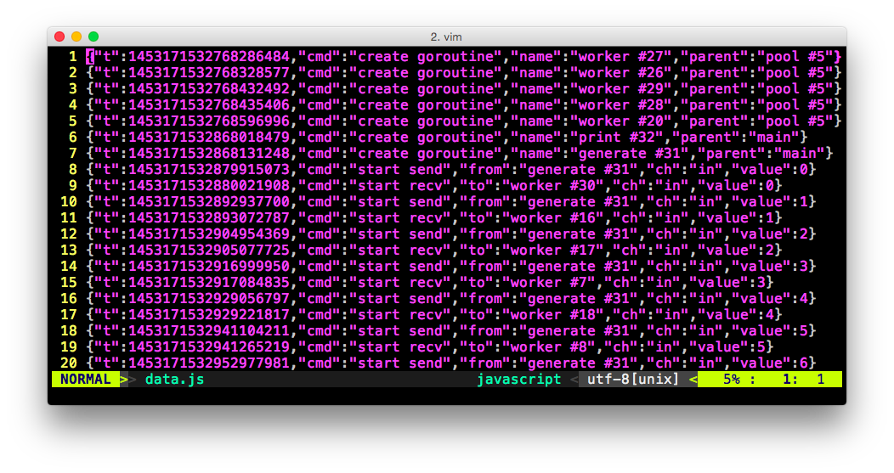

接下来gothree.js使用了[Three.js](http://threejs.org/)库的令人惊奇的能力用WebGL绘制3D线和对象。gothree.js只是做了一些包装，能把输出放在一张html网页上。

然而这个方法是有一定限制的。我必须精心选择例子程序，重命名channel和goroutine从而让复杂的代码能生成正确的trace信息。这个方法也不能处理goroutine之间使用同一个channel但是在gouroutine内部命名不同的情况。更不用说通过channel传递channel。另外，时序上也有很大的问题，trace信息打印到标准输出会消耗一些时间，所以在一些例子中我不得不增加一些sleep才能得到更合适的动画。

基本上，上面就是为什么我没有开源代码的原因。我最近在玩Dmitry Vyukov的[execution tracer](https://golang.org/cmd/trace/)，看起来它提供了很好的事件细节，但是它没有包含通过channel发送的值。或许可能还有其他更好的方法实现这个目标。可以在我们的推特评论中回复，如果你有更好的想法。如果能把这个2周完成的工具扩展成一个真正适用任何Go程序的调试追踪工具，这项工作会很伟大。

我会很高兴可视化更多的上面没有列出的并发算法和模式，如果你想到什么请自由的在评论中回复。

快乐编码！

更新：工具在[github.com/divan/gotrace](https://github.com/divan/gotrace)可用了，使用Go的运行时追踪和打了补丁的runtime生成trace信息。

另外，我对新工作就是开放的，如果你是一个有趣的公司或团队，有挑战的问题要解决，使用Go代码，可以远程办公（或者你再巴塞罗那），并且正在招聘，那么可以考虑我。


